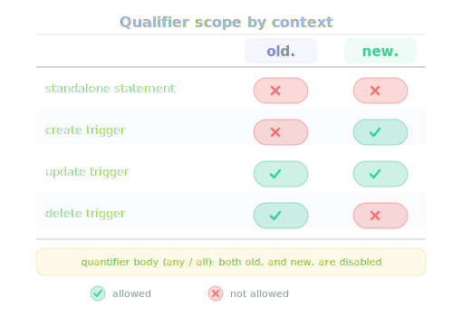
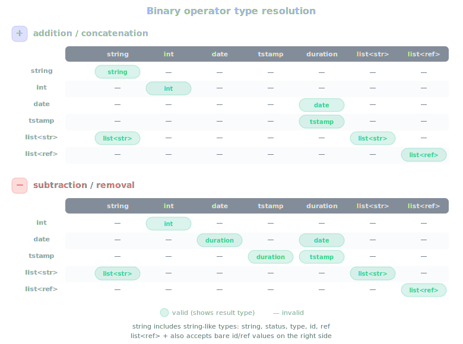

# Semantics

## Table of contents

- [Overview](#overview)
- [Statement semantics](#statement-semantics)
- [Trigger semantics](#trigger-semantics)
- [Qualifier scope](#qualifier-scope)
- [Condition and expression semantics](#condition-and-expression-semantics)

## Overview

This page explains how Ruki statements, triggers, conditions, and expressions behave.

## Statement semantics

`select`

- `select` without `where` means a statement with no condition node.
- `select where ...` validates the condition and its contained expressions.
- `select ... order by <field> [asc|desc], ...` specifies result ordering.
- A subquery form `select` or `select where ...` can appear only inside `count(...)`. Subqueries do not support `order by`.

`order by`

- Each field must exist in the schema and be an orderable type.
- Orderable types: `int`, `date`, `timestamp`, `duration`, `string`, `status`, `type`, `id`, `ref`.
- Non-orderable types: `list<string>`, `list<ref>`, `recurrence`, `bool`.
- Default direction is ascending. Use `desc` for descending.
- Duplicate fields are rejected.
- Only bare field names are allowed — `old.` and `new.` qualifiers are not valid in `order by`.

`create`

- `create` is a list of assignments.
- At least one assignment is required.
- The resulting task must have a non-empty `title`. This can come from an explicit `title=...` assignment or from the task template.
- Duplicate assignments to the same field are rejected.
- Every assigned field must exist in the injected schema.
- `id`, `createdBy`, `createdAt`, and `updatedAt` are immutable and cannot be assigned.

`update`

- `update` has two parts: a `where` condition and a `set` assignment list.
- At least one assignment in `set` is required.
- The `where` clause and every right-hand side expression are validated.
- Duplicate assignments inside `set` are rejected.
- `id`, `createdBy`, `createdAt`, and `updatedAt` are immutable and cannot be assigned.

`delete`

- `delete` always requires a `where` condition.
- The `where` condition is validated exactly like `select where ...`.

## Trigger semantics

Triggers have the shape:

```text
<timing> <event> [where <condition>] <deny-or-action>
```

Rules:

- `before` triggers must have `deny`.
- `before` triggers must not have an action or `run(...)`.
- `after` triggers must not have `deny`.
- `after` triggers must have either a CRUD action or `run(...)`.
- trigger CRUD actions may be `create`, `update`, or `delete`, but not `select`

Examples:

```sql
before update where new.status = "done" and dependsOn any status != "done" deny "cannot complete tiki with open dependencies"
after create where new.priority <= 2 and new.assignee is empty update where id = new.id set assignee="booleanmaybe"
after delete update where old.id in dependsOn set dependsOn=dependsOn - [old.id]
```

At runtime, triggers execute in a pipeline: before-triggers run as validators before persistence, the mutation is persisted, then after-triggers run as hooks. For the full execution model, cascade behavior, configuration, and runtime details, see [Triggers](triggers.md).

## Qualifier scope

Qualifier rules depend on the event:

- `create` triggers: `new.` is allowed, `old.` is not
- `delete` triggers: `old.` is allowed, `new.` is not
- `update` triggers: both `old.` and `new.` are allowed
- standalone statements: neither `old.` nor `new.` is allowed

Examples:

```sql
before create where new.type = "story" and new.description is empty deny "stories must have a description"
before delete where old.priority <= 2 deny "cannot delete high priority tikis"
before update where old.status = "in progress" and new.status = "done" deny "tikis must go through review before completion"
```



Important special case:

- inside a quantifier body such as `dependsOn any ...`, qualifiers are disabled again
- use bare fields inside the quantifier body, not `old.` or `new.`

Example:

```sql
before update where dependsOn any status = "done" deny "blocked"
```

## Condition and expression semantics

Conditions:

- comparisons validate both operand types before checking operator legality
- `is empty` and `is not empty` are allowed on every supported type
- `in` and `not in` require a collection on the right side
- `any` and `all` require `list<ref>` on the left side

Expressions:

- field references resolve through the injected schema
- qualified references use the same field catalog, then apply qualifier-policy checks
- list literals must be homogeneous
- `empty` is a context-sensitive zero value, resolved by surrounding type checks
- subqueries are only legal as the argument to `count(...)`

Binary `+` and `-` are semantic rather than purely numeric:

- string-like `+` yields `string`
- `int + int` and `int - int` yield `int`
- `list<string> +/- string-or-list<string>` yields `list<string>`
- `list<ref> +/- id-ref-compatible values` yields `list<ref>`
- `date + duration` yields `date`
- `date - duration` yields `date`
- `date - date` yields `duration`
- `timestamp + duration` yields `timestamp`
- `timestamp - duration` yields `timestamp`
- `timestamp - timestamp` yields `duration`



For the detailed type rules and built-ins, see [Types And Values](types-and-values.md) and [Operators And Built-ins](operators-and-builtins.md).

