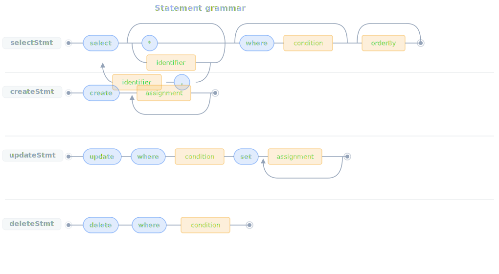
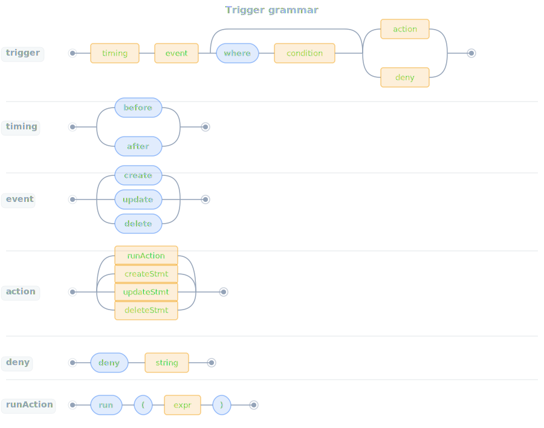
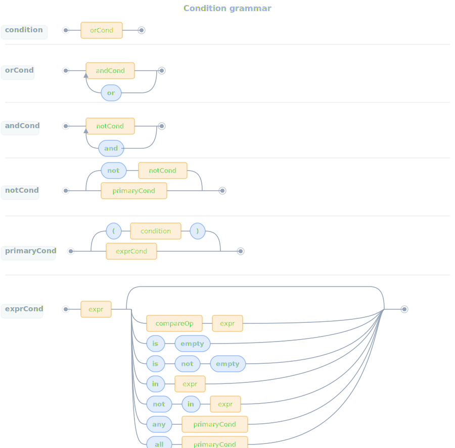
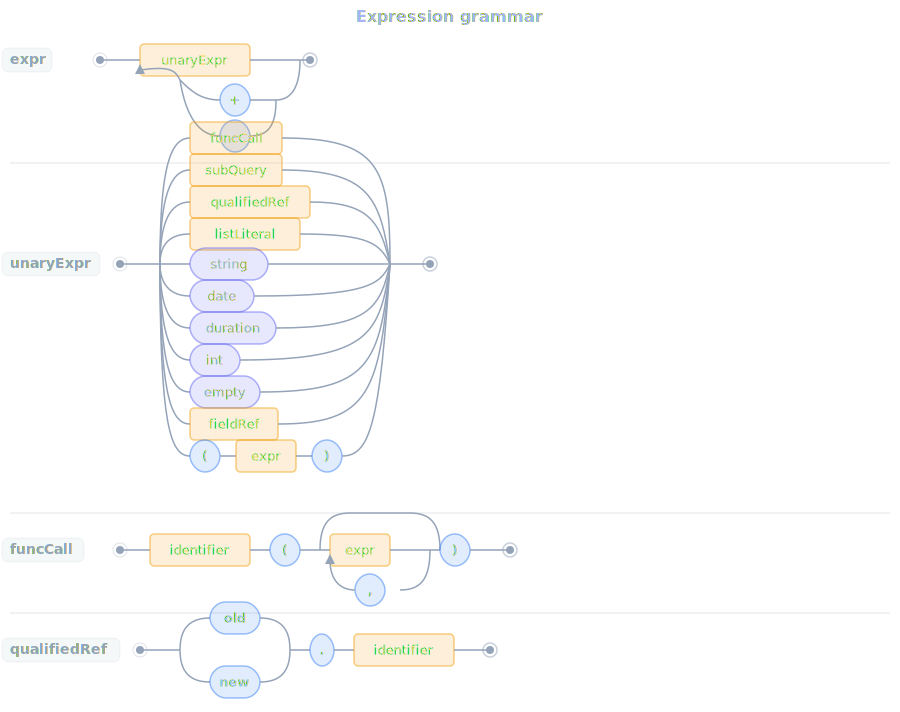

# Syntax

## Table of contents

- [Overview](#overview)
- [Lexical structure](#lexical-structure)
- [Top-level grammar](#top-level-grammar)
- [Condition grammar](#condition-grammar)
- [Expression grammar](#expression-grammar)
- [Operator binding summary](#operator-binding-summary)
- [Syntax notes](#syntax-notes)

## Overview

This page describes `ruki` syntax. It starts with tokens and then shows the grammar for statements, triggers,
conditions, and expressions.

## Lexical structure

`ruki` uses these token classes:

- comments: `--` to end of line
- whitespace: ignored between tokens
- durations: `\d+(sec|min|hour|day|week|month|year)s?`
- dates: `YYYY-MM-DD`
- integers: decimal digits only
- strings: double-quoted strings with backslash escapes
- comparison operators: `=`, `!=`, `<`, `>`, `<=`, `>=`
- binary operators: `+`, `-`
- star: `*`
- punctuation: `.`, `(`, `)`, `[`, `]`, `,`
- identifiers: `[a-zA-Z_][a-zA-Z0-9_]*`

Examples:

```sql
-- line comment
2026-03-25
2day
"hello"
dependsOn
new.status
```

## Top-level grammar

The following EBNF-style summary shows the grammar:

```text
statement        = selectStmt | createStmt | updateStmt | deleteStmt ;

selectStmt       = "select" [ fieldList | "*" ] [ "where" condition ] [ orderBy ] [ "limit" int ] [ pipeAction ] ;
fieldList        = identifier { "," identifier } ;
pipeAction       = "|" ( runAction | clipboardAction ) ;
clipboardAction  = "clipboard" "(" ")" ;
createStmt       = "create" assignment { assignment } ;

orderBy          = "order" "by" sortField { "," sortField } ;
sortField        = identifier [ "asc" | "desc" ] ;
updateStmt       = "update" "where" condition "set" assignment { assignment } ;
deleteStmt       = "delete" "where" condition ;

assignment       = identifier "=" expr ;

trigger          = timing event [ "where" condition ] ( action | deny ) ;
timing           = "before" | "after" ;
event            = "create" | "update" | "delete" ;

action           = runAction | createStmt | updateStmt | deleteStmt ;
runAction        = "run" "(" expr ")" ;
deny             = "deny" string ;

timeTrigger      = "every" duration ( createStmt | updateStmt | deleteStmt ) ;
```





Notes:

- `select` is a valid top-level statement, but it is not valid as a trigger action.
- `create` requires at least one assignment.
- `update` requires both `where` and `set`.
- `delete` requires `where`.
- `order by` is only valid on `select`, not on subqueries inside `count(...)`, `choose(...)`, or `exists(...)`.
- `limit` truncates the result set to at most N rows, applied after filtering and sorting but before any pipe action.
- `asc`, `desc`, `order`, `by`, and `limit` are contextual keywords — they are only special in the SELECT clause.
- Bare `select` and `select *` both mean all fields. A field list like `select title, status` projects only the
  named fields.
- `every` wraps a CRUD statement with a periodic interval. Only `create`, `update`, and `delete` are allowed

## Condition grammar

Condition precedence follows this order:

```text
condition        = orCond ;
orCond           = andCond { "or" andCond } ;
andCond          = notCond { "and" notCond } ;
notCond          = "not" notCond | primaryCond ;
primaryCond      = "(" condition ")" | exprCond ;

exprCond         = expr
                   [ compareTail
                   | isEmptyTail
                   | isNotEmptyTail
                   | notInTail
                   | inTail
                   | anyTail
                   | allTail ] ;

compareTail      = compareOp expr ;
isEmptyTail      = "is" "empty" ;
isNotEmptyTail   = "is" "not" "empty" ;
inTail           = "in" expr ;
notInTail        = "not" "in" expr ;
anyTail          = "any" primaryCond ;
allTail          = "all" primaryCond ;
```



Examples:

```sql
select where true
select where blocked
select where not blocked
select where status = "done"
select where assignee is empty
select where status not in ["done", "cancelled"]
select where dependsOn any status != "done"
select where not (status = "done" or priority = 1)
```

Field list:

```sql
select title, status
select id, title where status = "done"
select * where priority <= 2
select title, status where "bug" in tags order by priority
```

Order by:

```sql
select order by priority
select where status = "done" order by updatedAt desc
select where "bug" in tags order by priority asc, createdAt desc
```

Limit:

```sql
select order by priority limit 3
select where status != "done" order by priority limit 5
select limit 1
```

## Expression grammar

Expressions support literals, field references, qualifiers, function calls, list literals, parenthesized expressions,
subqueries, and left-associative `+` or `-` chains:

```text
expr             = unaryExpr { ("+" | "-") unaryExpr } ;

unaryExpr        = funcCall
                 | subQuery
                 | qualifiedRef
                 | listLiteral
                 | string
                 | date
                 | duration
                 | int
                 | emptyLiteral
                 | fieldRef
                 | "(" expr ")" ;

funcCall         = identifier "(" [ expr { "," expr } ] ")" ;
subQuery         = "select" [ "where" condition ] ;
qualifiedRef     = ( "old" | "new" | "outer" ) "." identifier ;
listLiteral      = "[" [ expr { "," expr } ] "]" ;
emptyLiteral     = "empty" ;
fieldRef         = identifier ;
```



Examples:

```sql
title
old.status
["bug", "frontend"]
next_date(recurrence)
count(select where assignee = outer.assignee)
exists(select where id in new.dependsOn and status != "done")
exists(select where outer.id in dependsOn)
2026-03-25 + 2day
tags + ["needs-triage"]
```

## Operator binding summary

Condition operators:

- highest: a condition in parentheses, or a condition built from a single expression
- then: `not`
- then: `and`
- lowest: `or`

Expression operators:

- only one binary precedence level exists for expressions
- `+` and `-` associate left to right

That means:

```sql
select where priority = 1 or priority = 2 and status = "done"
```

parses as:

```text
priority = 1 or (priority = 2 and status = "done")
```

## Syntax notes

- `any` and `all` apply to the condition that comes right after them. If you want to combine that condition with
  `and` or `or`, use parentheses.
- A condition can be a bare expression only when that expression has boolean type.
- `select` used inside expressions is only valid as a `count(...)`, `choose(...)`, or `exists(...)` argument. Bare
  subqueries are rejected during validation.
- The grammar accepts `run(<expr>)`, but only as the top-level action of an `after` trigger.
- `outer.` is only allowed inside subquery bodies, where it refers to the immediate parent row.
- `old.` and `new.` are only allowed in some trigger conditions. See [Semantics](semantics.md) and
  [Validation And Errors](validation-and-errors.md).
