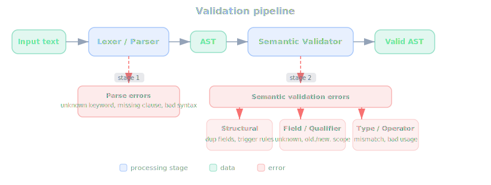

# Validation And Errors

## Table of contents

- [Overview](#overview)
- [Validation layers](#validation-layers)
- [Structural statement and trigger errors](#structural-statement-and-trigger-errors)
- [Field and qualifier errors](#field-and-qualifier-errors)
- [Type and operator errors](#type-and-operator-errors)
- [Enum and list errors](#enum-and-list-errors)
- [Order by errors](#order-by-errors)
- [Limit errors](#limit-errors)
- [require errors](#require-errors)
- [Built-in and subquery errors](#built-in-and-subquery-errors)

## Overview

This page explains the errors you can get in `ruki`. It covers syntax errors, unknown fields, type mismatches,
invalid enum values, unsupported operators, and invalid trigger structure.

## Validation layers



`ruki` has two distinct failure stages:

1. Parse-time failures
2. Validation-time failures

Parse-time failures happen when the input does not fit the grammar at all.

Examples:

```sql
drop where id = 1
update set status="done"
delete id = "x"
after update select
```

Validation-time failures happen after parsing, once the AST is checked against schema and semantic rules.

Examples:

```sql
select where foo = "bar"
create title="x" priority="high"
select where status < "done"
before update where new.status = "done"
```

## Structural statement and trigger errors

Statements:

- `create` must have at least one assignment
- `update` must have at least one assignment in `set`
- duplicate assignments to the same field are rejected

Triggers:

- `before` triggers must have `deny`
- `before` triggers must not have action or `run(...)`
- `after` triggers must have an action or `run(...)`
- `after` triggers must not have `deny`
- trigger actions must not be `select`

Examples:

```sql
before update where new.status = "done" update where id = old.id set status="done"
after update where new.status = "done" deny "no"
before update where new.status = "done"
after update where new.status = "done"
```

## Field and qualifier errors

Unknown field errors:

```sql
select where foo = "bar"
create title="x" foo="bar"
```

Immutable field errors:

- `id`, `createdBy`, `createdAt`, and `updatedAt` cannot be assigned in `create` or `update`

```sql
create title="x" id="TIKI-ABC123"
update where status = "done" set createdBy="someone"
```

Qualifier misuse:

- `old.` and `new.` are invalid in standalone statements
- `old.` is invalid in create-trigger contexts
- `new.` is invalid in delete-trigger contexts
- both are invalid inside quantifier bodies
- `outer.` is invalid outside `count(...)`, `choose(...)`, and `exists(...)` subquery bodies

Examples:

```sql
select where old.status = "done"
create title=old.title
after create where old.status = "done" update where id = new.id set status="done"
before delete where new.status = "done" deny "x"
before update where dependsOn any old.status = "done" deny "blocked"
select where outer.id = id
create title=outer.title
before update where outer.id = new.id deny "blocked"
```

## Required field errors

The resulting task from `create` must have a non-empty `title`. If the template does not provide one, a
`title=...` assignment is required.

`title`, `status`, `type`, and `priority` reject `empty` assignment:

```sql
create title="" priority=2
create title="x" status=empty
update where id = "TIKI-ABC123" set priority=empty
```

## Type and operator errors

Bare expression conditions must be boolean:

```sql
select where title
select where priority
select where tags
```

Comparison mismatches:

```sql
select where priority = "high"
select where status = title
select where type = assignee
```

Unsupported operators:

```sql
select where title < "hello"
select where status < "done"
select where recurrence < recurrence
```

Invalid assignment types:

```sql
create title="x" priority="high"
create title="x" assignee=42
create title="x" status=title
update where id="x" set title=status
```

Invalid binary expressions:

```sql
create title="x" priority=1 + "a"
select where due = 2026-03-25 + 2026-03-20
create title="x" dependsOn=dependsOn + status
create title="x" dependsOn=dependsOn + tags
```

## Enum and list errors

Unknown enum values:

```sql
select where status = "nonexistent"
select where type = "nonexistent"
create title="x" status="nonexistent"
create title="x" type="nonexistent"
```

Invalid enum list membership:

```sql
select where status in ["done", "bogus"]
select where type in ["bug", "bogus"]
```

List strictness:

- list literals must be homogeneous
- `list<string>` fields reject non-string elements
- the special `list<ref>` assignment path accepts string-literal lists, but not arbitrary string fields or mixed
  element expressions

Invalid examples:

```sql
select where status in ["done", 1]
create title="x" tags=[1, 2]
create title="x" dependsOn=["TIKI-ABC123", title]
select where status in dependsOn
select where tags any status = "done"
```

## Order by errors

Unknown field:

```sql
select order by nonexistent
```

Non-orderable types:

```sql
select order by tags
select order by dependsOn
select order by recurrence
```

Duplicate field:

```sql
select order by priority, priority desc
```

Order by inside a subquery:

```sql
select where count(select where status = "done" order by priority) >= 1
```

## Limit errors

Validation error (must be positive):

```sql
select limit 0
```

Parse errors (invalid token after `limit`):

```sql
select limit -1
select limit "three"
select limit
```

## Pipe validation errors

Pipe actions (`| run(...)` and `| clipboard()`) on `select` have several restrictions:

`select *` with pipe:

```sql
select * where status = "done" | run("echo $1")
select * where status = "done" | clipboard()
```

Bare `select` with pipe:

```sql
select | run("echo $1")
select | clipboard()
```

Both are rejected because explicit field names are required when using a pipe. This applies to both `run()` and
`clipboard()` targets.

Non-string command:

```sql
select id where status = "done" | run(42)
```

Field references in command:

```sql
select id, title where status = "done" | run(title + " " + id)
select id, title where status = "done" | run("echo " + title)
```

Field references are not allowed in the pipe command expression itself. Use positional arguments (`$1`, `$2`) instead.

Pipe on non-select statements:

```sql
update where status = "done" set priority=1 | run("echo done")
create title="x" | run("echo created")
delete where id = "TIKI-ABC123" | run("echo deleted")
```

Pipe suffix is only valid on `select` statements.

## Built-in and subquery errors

Unknown function:

```sql
select where foo(1) = 1
```

Argument count errors:

```sql
select where now(1) = now()
select where count() >= 1
select where exists()
select where user(1) = "bob"
```

Argument type errors:

```sql
select where blocks(priority) is empty
create title=call(42)
create title="x" due=next_date(42)
```

Subquery restrictions:

- only `count(...)`, `choose(...)`, and `exists(...)` accept a subquery
- bare subqueries elsewhere are rejected
- `count(...)`, `choose(...)`, and `exists(...)` validate the subquery body recursively
- subquery bodies may use `outer.` to refer to the immediate parent row

Examples:

```sql
select where count(select where assignee = outer.assignee) >= 1
select where exists(select where outer.id in dependsOn)
select where count(select where nosuchfield = "x") >= 1
before update where exists(select where id in new.dependsOn and status != "done") deny "blocked"
select where exists("x")
select where select = 1
create title=select
```

## require errors

Action `require` entries are validated at workflow load time. Each entry must be a non-empty string. A bare `!`
(negation prefix with no attribute name) is rejected.

Empty requirement:

```yaml
actions:
  - key: "x"
    label: "Bad"
    action: update where id = id() set status="done"
    require: [""]
```

Fails with: `empty requirement`.

Bare negation:

```yaml
actions:
  - key: "x"
    label: "Bad"
    action: update where id = id() set status="done"
    require: ["!"]
```

Fails with: `bare '!' is not a valid requirement`.

In YAML, negated requirements must be quoted to avoid parse errors:

```yaml
# correct — quoted
require: ["!view:plugin:Kanban"]

# incorrect — unquoted ! is a YAML tag indicator
require: [!view:plugin:Kanban]
```

## input() errors

`input()` without `input:` declaration on the action:

```sql
update where id = id() set assignee = input()
```

Fails at workflow load time with: `input() requires 'input:' declaration on action`.

`input:` declared but `input()` not used:

```yaml
- key: "a"
  label: "Ready"
  action: update where id = id() set status="ready"
  input: string
```

Fails at workflow load time: `declares 'input: string' but does not use input()`.

Duplicate `input()` (more than one call per action):

```sql
update where id = id() set assignee=input(), title=input()
```

Fails with: `input() may only be used once per action`.

Type mismatch (declared type incompatible with target field):

```yaml
- key: "a"
  label: "Assign to"
  action: update where id = id() set assignee = input()
  input: int
```

Fails at workflow load time: `int` is not assignable to string field `assignee`.

`input()` with arguments:

```sql
update where id = id() set assignee = input("name")
```

Fails with: `input() takes no arguments`.

## choose() errors

`choose()` without a subquery argument:

```sql
update where id = id() set assignee = choose()
```

Fails with: `choose() expects 1 argument(s), got 0`.

`choose()` with a non-subquery argument:

```sql
update where id = id() set assignee = choose("epic")
```

Fails with: `choose() argument must be a select subquery`.

Duplicate `choose()` (more than one call per action):

```sql
update where id = id() set assignee = choose(select where status = "ready") title = choose(select where type = "epic")
```

Fails with: `choose() may only be used once per action`.

`choose()` combined with `input()` in the same action:

```yaml
- key: "e"
  label: "Link"
  action: update where id = id() set assignee = input() title = choose(select)
  input: string
```

Fails at workflow load time with: `input() and choose() cannot be used in the same action`.

`choose()` outside plugin runtime (CLI, trigger):

```sql
update where status = "backlog" set assignee = choose(select)
```

Fails with: `choose() requires user interaction and is only valid in plugin actions`.

