# Themes

## Setting a theme

Set the theme in your `config.yaml` under the `appearance` section (see [Configuration](config.md) for file locations and precedence):

```yaml
appearance:
  theme: dracula
```

Available values:
- `auto` — detects your terminal background and picks `dark` or `light` automatically (default)
- `dark`, `light` — built-in base themes
- Any named theme listed below

## Dark themes

### dark

The built-in dark base theme. Used by `auto` when a dark terminal background is detected.

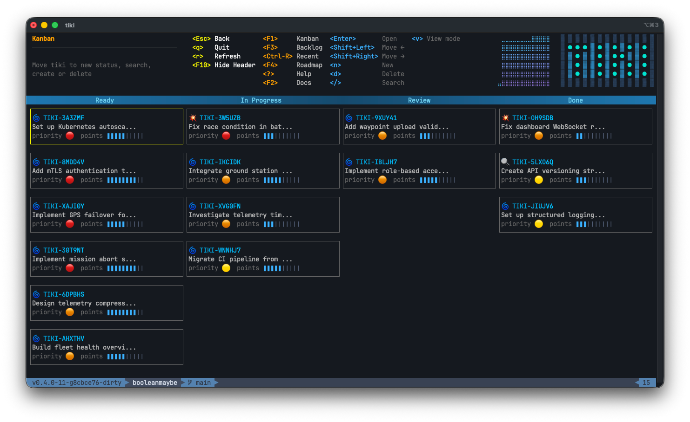

### dracula

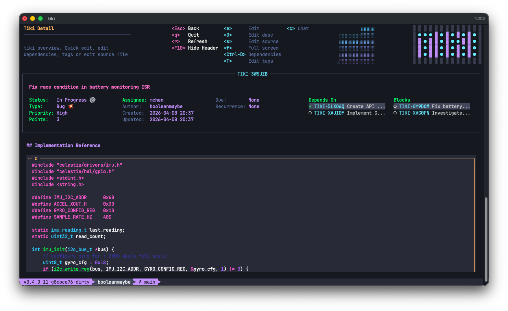

### tokyo-night

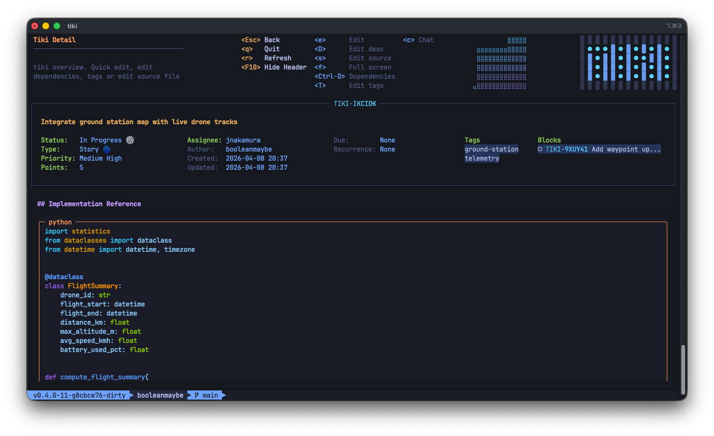

### gruvbox-dark

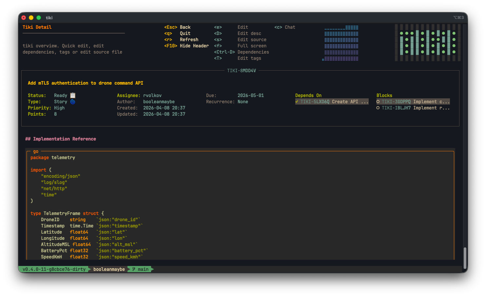

### catppuccin-mocha

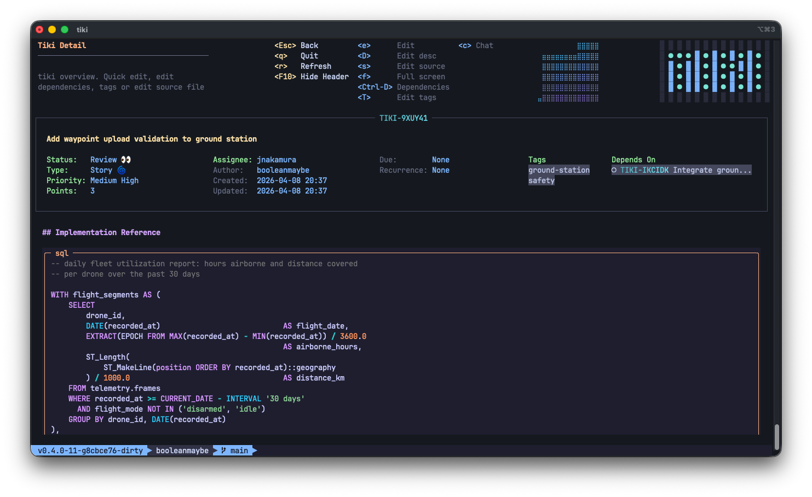

### solarized-dark

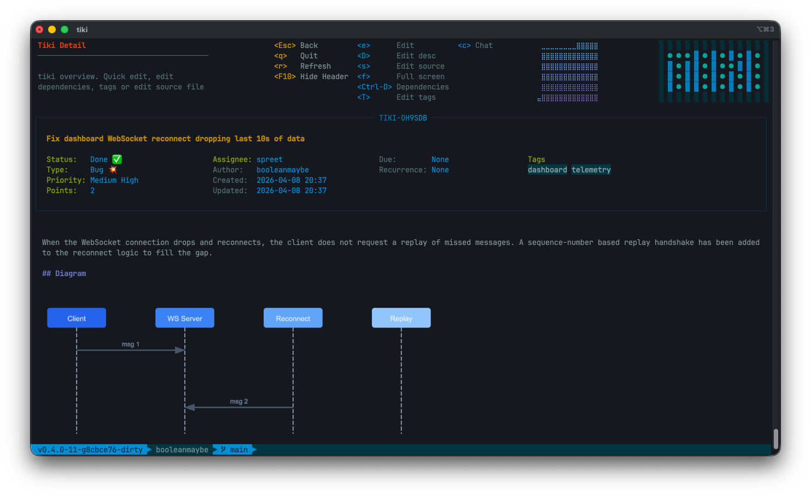

### nord

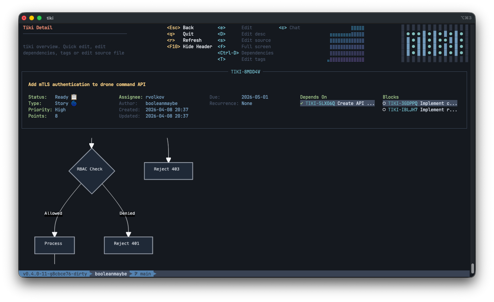

### monokai

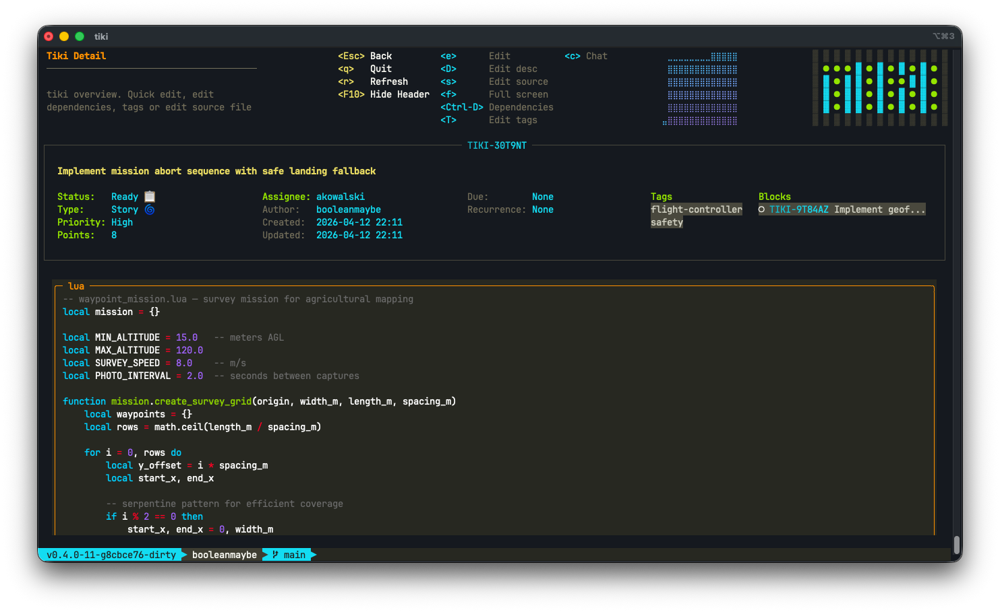

### one-dark

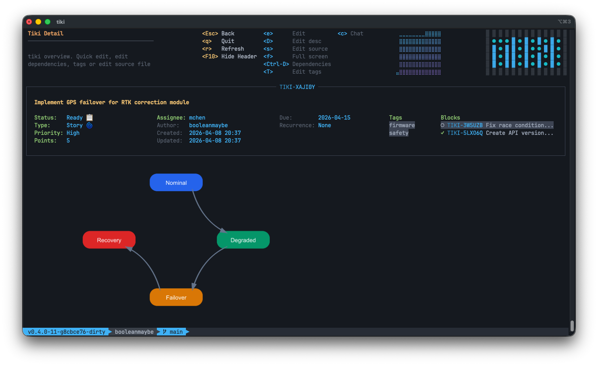

## Light themes

### light

The built-in light base theme. Used by `auto` when a light terminal background is detected.

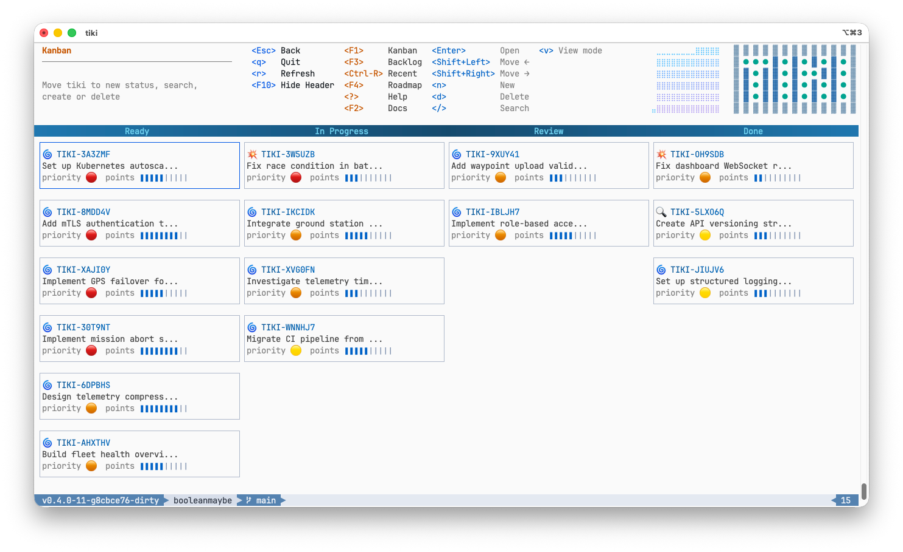

### catppuccin-latte

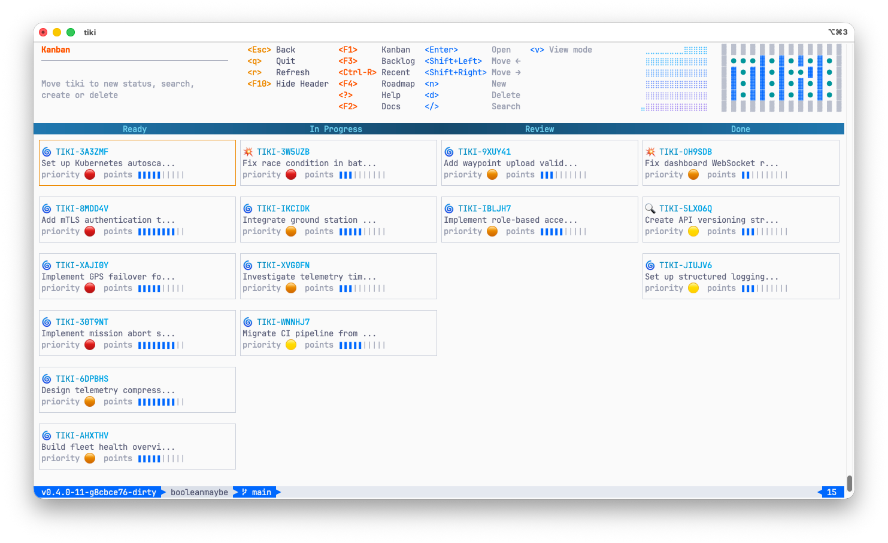

### solarized-light

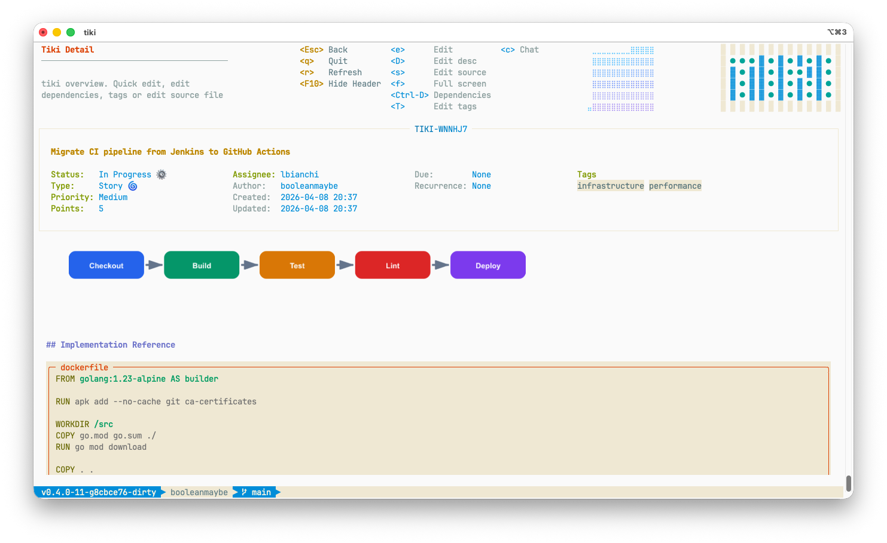

### gruvbox-light

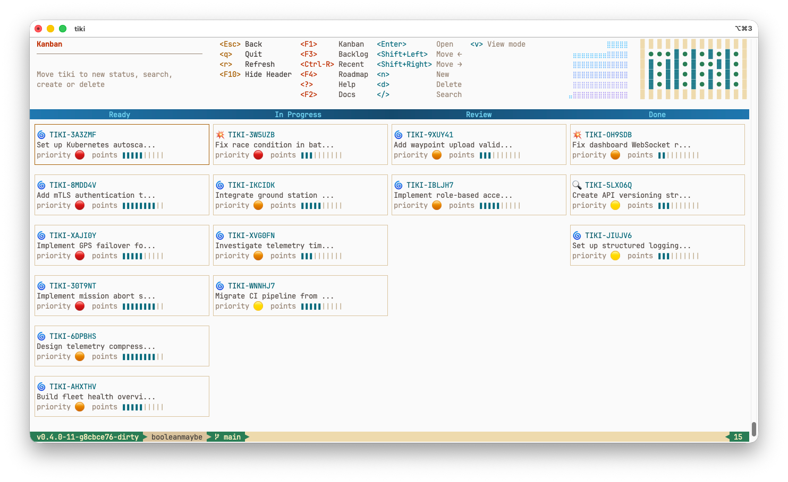

### github-light

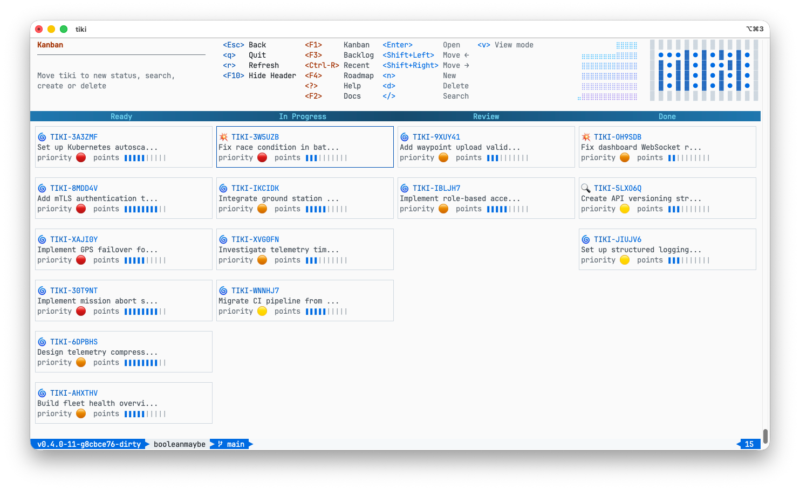
