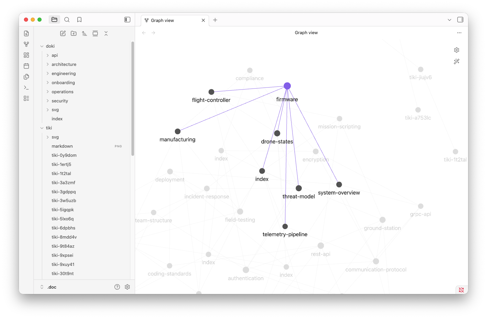

# Tips, tricks, and FAQ

A collection of handy tips, tricks, and frequently asked questions.

## Contents

- [Create tiki from markdown file](#create-tiki-from-markdown-file)
- [Find tiki by ID](#find-tiki-by-id)
- [Link to another tiki](#link-to-another-tiki)
- [Find recently edited tikis](#find-recently-edited-tikis)
- [Quick create](#quick-create)
- [I created a new tiki but I can't find it](#i-created-a-new-tiki-but-i-cant-find-it)
- [How to edit workflow file](#how-to-edit-workflow-file)
- [Open a tiki project in Obsidian](#open-a-tiki-project-in-obsidian)
- [Open the current tiki in VS Code](#open-the-current-tiki-in-vs-code)
- [Chat with AI](#chat-with-ai)
- [Copy description](#copy-description)
- [Quickly add or remove a tag](#quickly-add-or-remove-a-tag)
- [Can I implement XYZ using tiki?](#can-i-implement-xyz-using-tiki)
- [Remove an annoying tag from all tikis](#remove-an-annoying-tag-from-all-tikis)
- [Daily standup digest](#daily-standup-digest)
- [Sync tikis to GitHub issues](#sync-tikis-to-github-issues)
- [How many tikis are in my project](#how-many-tikis-are-in-my-project)

### Create tiki from markdown file

Pipe a markdown file into `tiki`:

```bash
tiki < notes.md
```

If the first line is a markdown heading (`# Title`, `## Title`, etc.), the leading `#` characters are
stripped automatically for the task title. The full original markdown — heading included — is kept
as the description.

### Find document by ID

Press `/` to open the search box, then start typing the id. Matching is case-insensitive and works on
any substring, so `ab12c3` and `AB12C3` both find the same document.

Press Enter to keep the filter active (search passive mode), or Esc to clear it.

### Link to another document

Inside a document body you can cross-reference another document with a wikilink-style reference:

```markdown
See also [[ABC123]] for background.
```

Wikilinks resolve through the document index, so they survive file moves. Open the detail view,
press `Tab` to highlight the link, then Enter to navigate. The linked document loads in the same
pane; `Left` / `Alt-Left` takes you back.

Plain Markdown links also work — use them for anchored links inside a document or for external URLs.

### Find recently edited tikis

Press `Ctrl-R` to open the **Recent** view. It shows every tiki touched in the last 24 hours,
most recently updated first. Useful for "what did I work on yesterday?" or picking up where you
left off after lunch.

Defined in the stock workflow YAML:

```yaml
- name: Recent
  description: "Tasks changed in the last 24 hours, most recent first"
  key: Ctrl-R
  lanes:
    - name: Recent
      columns: 4
      filter: select where now() - updatedAt < 24hour order by updatedAt desc
```

Widen the window by editing the filter — e.g. `< 7day` for a week, `< 1hour` for the last hour.

### Quick create

Press `Ctrl-Q`, type a title, press Enter.

Defined in the workflow YAML (`config/workflows/kanban.yaml`):

```yaml
- key: Ctrl-Q
  label: "Quick create"
  action: create title=input()
  input: string
```

Add fields to pre-fill defaults, e.g. `action: create title=input() type="bug" priority=1`.

### I created a new tiki but I can't find it

Each view's lanes have filters on both `status` and `type`, so a new tiki may land in a view other
than the one you're looking at:

- **Status** — new tiki get the workflow's default status (e.g. `backlog`). In the stock Kanban
  workflow the default view is Kanban but new tiki land in Backlog.
- **Type** — epics are filtered out of Kanban and Backlog (`type != "epic"`) and only appear in
  Roadmap.

Switch to the view that matches. To change the behavior, either pre-set fields in the create
action (e.g. `action: create title=input() status="ready"`) or adjust the defaults in the workflow
YAML.

### How to edit workflow file

There's no hotkey for it — open the action palette with `Ctrl-A` and pick **Edit Workflow**. Tiki
opens the workflow YAML in `$EDITOR`. When you exit the editor, restart tiki for the changes to
take effect.

### Open a tiki project in Obsidian

an Obsidian vault from folder needs to be created first, then:

```
obsidian vault=my-project open
```


opens Obsidian vault and browse the markdown with backlinks, graph view, and live preview.

```bash
# Obsidian does not display dot folders
ln -s .doc doc
# if you want to keep in git
git add doc
git commit -m "add doc symlink for Obsidian"
```

### Open the current tiki in VS Code

Add this to the top-level `actions:` list in your workflow YAML:

```yaml
actions:
  - key: "o"
    kind: ruki
    label: "Open in VS Code"
    action: select filepath where id = id() | run("code \"$1\"")
```

`filepath` is the synthetic field with the document's absolute path; `$1` passes it to the `code`
CLI, which opens the file in a VS Code window.

### Chat with AI

Select a tiki and press `c`. Tiki launches your configured AI agent with the tiki already read
in — start chatting immediately, no copy-paste.

Ask the agent to edit the tiki's **description**. Examples:

- "Expand this into a full spec with background, goals, and risks."
- "Add a checklist of implementation steps."
- "Rewrite in clearer language and add acceptance criteria."

When you exit the agent, tiki reloads and the updated description appears.

Requires `ai.agent` to be set in `config.yaml`; if not configured, the `c` key is hidden. See
[AI collaboration](ai.md) for setup.

### Copy description

Need to copy a tiki's description to paste later? Press `Y` (shift-Y) to copy the title and
description to the clipboard. Press `y` (lowercase) for just the ID.

To copy more fields, extend the `select` in the workflow YAML:

```yaml
- key: "Y"
  label: "Copy content"
  action: select title, description, status, assignee where id = id() | clipboard()
```

### Quickly add or remove a tag

Press `t` to add a tag, `T` (shift-T) to remove one. Both prompt for the tag name.

Under the hood these are list-arithmetic updates:

```yaml
- key: "t"
  label: "Add tag"
  action: update where id = id() set tags=tags+input()
  input: string
- key: "T"
  label: "Remove tag"
  action: update where id = id() set tags=tags-input()
  input: string
```

### Can I implement XYZ using tiki?

Yes.

### Remove an annoying tag from all tikis

Use `tiki exec` to run a ruki update across the whole store:

```bash
tiki exec 'update where "idea" in tags set tags=tags-"idea"'
```

Or press `!` from any view and type the same statement

### Daily standup digest

Copy your in-flight work to the clipboard, ready to paste into Slack or standup notes:

```bash
tiki exec 'select id, title where status = "inProgress" and assignee = user() | clipboard()'
```

Add `order by updated desc limit 5` for a "what I touched recently" shortlist.

The same statement runs in-app: press `!` on any view

### Sync tikis to GitHub issues

Every CLI tool is a tiki integration. Tag the tikis you want to push, then pipe them into `gh`:

```bash
tiki exec '
  select id, title, description where "sync-gh" in tags
  | run("gh issue create --title \"$2\" --body \"$3\" --label tiki:$1")
'
```

The pipe runs the command once per matching tiki, substituting `$1`, `$2`, `$3` with the selected
fields. Swap `gh issue create` for `curl`, `slack`, `jira`, or anything else — tiki doesn't need
built-in integrations, ruki pipes *are* the integration layer.

Prefer running it without leaving the TUI? Press `!`, paste the statement and press Enter

### How many tikis are in my project

Wrap a bare `select` in `count(...)` and `tiki exec` prints the number:

```bash
tiki exec 'count(select)'
```

Add a `where` clause to count a slice:

```bash
tiki exec 'count(select where status != "done")'
tiki exec 'count(select where assignee = user() and status = "inProgress")'
```

These also work from `!` inside tiki — type the ruki statement and
the count prints in the status line.

