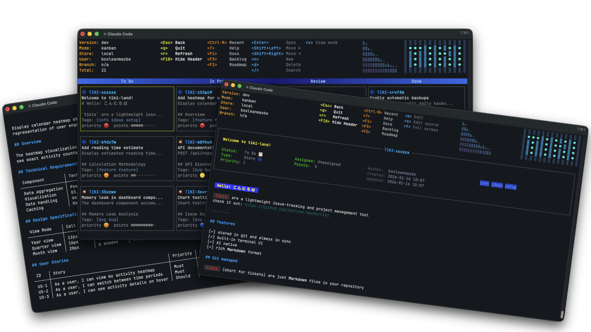
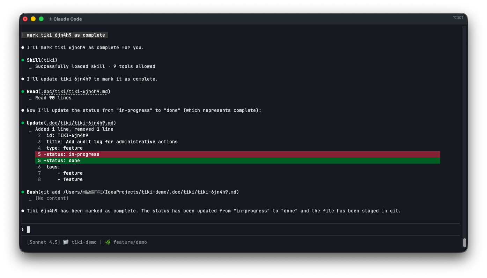

Follow me on X: [](https://x.com/booleanandmaybe)

# tiki

**Update:** [v0.5.0 and custom fields](https://github.com/boolean-maybe/tiki/releases/tag/v0.5.0)

`tiki` is a terminal-first Markdown workspace for tasks, docs, prompts, and notes stored in your **git** repo



[Documentation](.doc/doki/doc/index.md)

What `tiki` does:

- Standalone **Markdown viewer** with images, Mermaid diagrams, and link/TOC navigation
- Keep, search, view and version Markdown documents in the **git repo** — everything lives under a single
  `.doc/` tree, identified by a bare frontmatter `id`
- **Wiki-style** documentation with arbitrary folder hierarchy and multiple entry points
- Keep a **to-do list** with priorities, status, assignee and size
- Issue management with **Kanban/Scrum** style board and burndown chart
- SQL-like command language [ruki](.doc/doki/doc/ruki/index.md) to query and update documents and define
  custom workflows
- **Plugin-first** architecture — user-defined views based on [ruki](.doc/doki/doc/ruki/index.md) and
  custom view kinds (`board`, `list`, `wiki`, `detail`)
- AI **skills** to enable [Claude Code](https://code.claude.com),
  [Gemini CLI](https://github.com/google-gemini/gemini-cli), [Codex](https://openai.com/codex), and
  [Opencode](https://opencode.ai) work with natural language commands like
  "_create a task from @my-file.md_"
  "_mark ABC123 as complete_"

## Installation

### Mac OS and Linux
```bash
curl -fsSL https://raw.githubusercontent.com/boolean-maybe/tiki/main/install.sh | bash
```


### Mac OS via brew
```bash
brew install boolean-maybe/tap/tiki
```

### Windows
```powershell
# Windows PowerShell
iwr -useb https://raw.githubusercontent.com/boolean-maybe/tiki/main/install.ps1 | iex
```

### Manual install

Download the latest distribution from the [releases page](https://github.com/boolean-maybe/tiki/releases) 
and simply copy the `tiki` executable to any location and make it available via `PATH`

### Build from source

```bash
git clone https://github.com/boolean-maybe/tiki.git
cd tiki
make build install
```

### Verify installation
```bash
tiki --version
tiki --help
```

## Quick start

### Markdown viewer


`tiki my-markdownfile` to view, edit and navigate markdown files in terminal.
if you have no Markdown file to try - use this:
```
tiki https://github.com/boolean-maybe/tiki/blob/main/testdata/go-concurrency.md
```
see [requirements](.doc/doki/doc/image-requirements.md) for supported terminals, SVG and diagrams support

All vim-like pager commands are supported in addition to:
- `Tab/Enter` to select and load a link in the document
- `e` to edit it in your favorite editor

### File and issue management


to try with a demo project just run:

```
cd /tmp && tiki demo
```

this will open a demo project. Once done you can try your own:

Run `tiki init my-directory` to initialize a project, then `cd my-directory` and run `tiki` to start

Move a task around the board with `Shift ←/Shift →`.

### AI skills
You will be prompted to install skills for
- [Claude Code](https://code.claude.com)
- [Gemini CLI](https://github.com/google-gemini/gemini-cli)
- [Codex](https://openai.com/codex)
- [Opencode](https://opencode.ai)

once installed, mention documents by id in your prompts to create, find, or edit them.


### Quick capture

Quick-capture ideas by redirecting to `tiki`:
```bash
echo "cool idea" | tiki
gh issue view 42 --json title,body -q '"\(.title)\n\n\(.body)"' | tiki
curl -s https://sentry.io/api/issues/latest/ | jq -r '.title' | tiki
grep ERROR server.log | sort -u | while read -r line; do echo "$line" | tiki; done
```

Read more [quick capture docs](.doc/doki/doc/quick-capture.md).

## The managed document model

One format, one workspace: everything `tiki` manages is a Markdown file with YAML frontmatter under `.doc/`.

```md
---
id: ABC123
title: Implement search
status: backlog
priority: 2
---

Markdown body.
```

- **Identity is in the frontmatter.** Every managed document has a bare 6-character uppercase `id` (e.g. `ABC123`).
  The file path is mutable organization, not identity — move or rename files freely, the `id` follows the document.
- **`.doc/**/*.md` is managed.** The whole tree is scanned recursively. Workflow config files (`workflow.yaml`,
  `config.yaml`) and non-Markdown assets are excluded.
- **Workflow fields are optional.** A document with `status`, `type`, `priority`, or `points` in its frontmatter
  participates in board/list views and burndown. A document without those fields is a plain note — reachable by id
  or path, rendered in markdown views, invisible to workflow views.
- **Views decide behavior.** Board and list views filter by workflow fields; wiki and detail views render document
  bodies. No persistent tiki-vs-doki split.
- **Git-controlled.** Documents are added, updated, and removed via git as you work. History is preserved.

## The tiki TUI

`tiki` opens a terminal UI that lets you create, view, edit, and delete documents, plus compose custom views
over any slice of the workspace — Recent items, Architecture notes, Saved prompts, Security reviews, Future roadmap.
Press `?` to open the Action Palette and discover every available action.

## AI skills

`tiki` adds optional [agent skills](https://agentskills.io/home) to the repo upon initialization.
If installed you can:

- work with [Claude Code](https://code.claude.com),
  [Gemini CLI](https://github.com/google-gemini/gemini-cli), [Codex](https://openai.com/codex), and
  [Opencode](https://opencode.ai) by mentioning documents or ids in your prompts
- create, find, modify, and delete documents using AI
- create documents directly from Markdown files
- reference documents by id when implementing with AI-assisted development — `implement ABC123`
- keep a history of prompts/plans by saving them as documents alongside your repo

## Feedback

Feedback is always welcome! Whether you have an improvement request, a feature suggestion
or just chat:
- use GitHub issues to submit and issue or a feature request
- use GitHub discussions for everything else
- follow and DM on [X](https://x.com/booleanandmaybe)

to contribute:
[Contributing](CONTRIBUTING.md)

## Badges


[](https://goreportcard.com/report/github.com/boolean-maybe/tiki)
[](https://pkg.go.dev/github.com/boolean-maybe/tiki)
