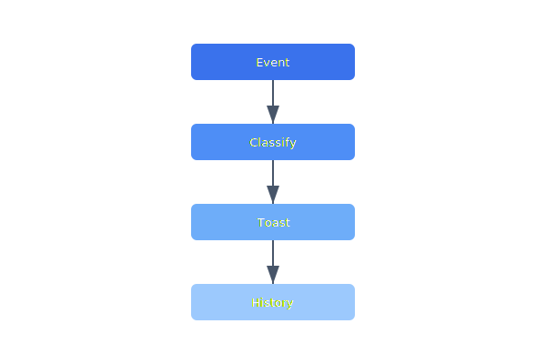

Critical mission events (abort, geofence warning, low battery) currently only appear in the log panel. A notification center with severity-based toasts and a searchable history will improve operator situational awareness.

## Diagram



## Implementation Reference

```css
/* fleet dashboard — drone status cards */
.fleet-grid {
  display: grid;
  grid-template-columns: repeat(auto-fill, minmax(280px, 1fr));
  gap: 1rem;
  padding: 1.5rem;
}

.drone-card {
  background: #1a1f2e;
  border: 1px solid #2d3548;
  border-radius: 8px;
  padding: 1rem 1.25rem;
  transition: border-color 0.15s ease;
}

.drone-card:hover {
  border-color: #4a90d9;
}

.drone-card__header {
  display: flex;
  justify-content: space-between;
  align-items: center;
  margin-bottom: 0.75rem;
}

.drone-card__id {
  font-family: "JetBrains Mono", monospace;
  font-size: 0.875rem;
  color: #e2e8f0;
}

.drone-card__status {
  font-size: 0.75rem;
  padding: 2px 8px;
  border-radius: 4px;
  font-weight: 600;
  text-transform: uppercase;
}

.drone-card__status--active {
  background: rgba(34, 197, 94, 0.15);
  color: #4ade80;
}

.drone-card__status--idle {
  background: rgba(250, 204, 21, 0.15);
  color: #facc15;
}

.drone-card__status--offline {
  background: rgba(239, 68, 68, 0.15);
  color: #f87171;
}

.drone-card__metrics {
  display: grid;
  grid-template-columns: 1fr 1fr;
  gap: 0.5rem;
  font-size: 0.8rem;
  color: #94a3b8;
}
```

## Specification

| Widget | Data Source | Refresh Rate | Priority |
| --- | --- | --- | --- |
| Fleet Map | Telemetry WS | 1s | P1 |
| Battery Grid | Telemetry WS | 5s | P1 |
| Mission Status | REST API | 10s | P2 |
| Weather Overlay | External API | 60s | P3 |
| Alert Feed | Event Stream | Real-time | P1 |

---

> Dashboard performance is critical for operational safety. Widgets must degrade gracefully when data sources are unavailable, showing the last known value with a staleness indicator rather than blank panels.

### Requirements

1. Initial dashboard load must complete within 2 seconds
2. WebSocket reconnect must be transparent to widgets
3. All widgets must handle missing data without crashing
4. Dashboard must support 50+ simultaneous drone tracks

### Checklist

- [x] Implement widget drag-and-drop layout editor
- [ ] Add per-operator dashboard presets
- [x] Build battery trend sparkline component
- [ ] Create configurable alert threshold panel
- [ ] Support dashboard export as PDF for reports
