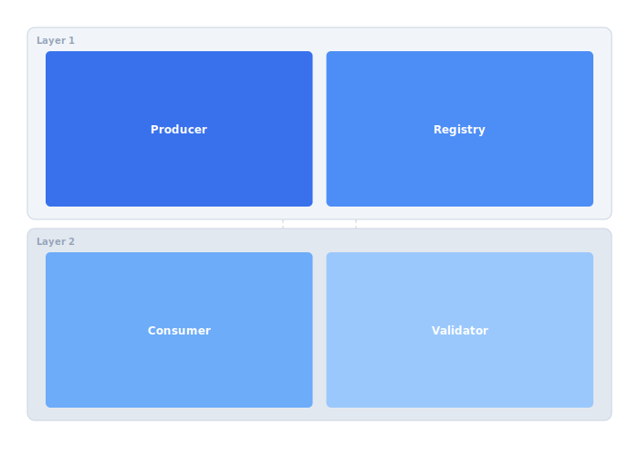

Multiple services produce and consume telemetry protobufs but there is no schema compatibility enforcement. A Buf-based registry with CI checks will prevent breaking changes from reaching production.

## Diagram



## Implementation Reference

```json
{
  "drone_id": "CX7-0042",
  "mission_id": "MSN-20260315-0819",
  "status": "inProgress",
  "telemetry": {
    "timestamp": "2026-03-15T08:23:41.003Z",
    "position": {
      "latitude": 37.41589,
      "longitude": -122.07734,
      "altitude_msl": 85.3
    },
    "velocity": {
      "ground_speed_ms": 12.4,
      "vertical_speed_ms": -0.2,
      "heading_deg": 274.1
    },
    "battery": {
      "voltage": 22.1,
      "current_a": 14.6,
      "remaining_pct": 63,
      "temperature_c": 38.2
    },
    "flight_mode": "mission",
    "satellites": 18,
    "fix_type": "rtk_fixed"
  },
  "waypoint_progress": {
    "current": 7,
    "total": 24,
    "distance_to_next_m": 142.8
  }
}
```

## Specification

| Endpoint | Method | Auth | Rate Limit |
| --- | --- | --- | --- |
| /v1/telemetry | POST | mTLS | 10k/min |
| /v1/missions | GET/POST | Bearer | 100/min |
| /v1/commands | POST | mTLS | 50/min |
| /v1/fleet/status | GET | Bearer | 200/min |
| /v1/alerts | GET/WS | Bearer | 500/min |

---

> All API endpoints must be documented in the OpenAPI spec before implementation. Breaking changes require a new version prefix and a minimum 90-day deprecation notice to integrators.

### Requirements

1. API response time P99 must be under 200ms
2. All endpoints must return structured error responses
3. Pagination must use cursor-based tokens, not offsets
4. WebSocket endpoints must support backpressure signaling

### Checklist

- [x] Generate Go client from OpenAPI spec
- [ ] Add request validation middleware
- [x] Implement rate limiting per API key
- [ ] Build integration test suite for v1 endpoints
- [ ] Add gRPC gateway for internal service calls

See also [MVIHCW](MVIHCW) for related context.
