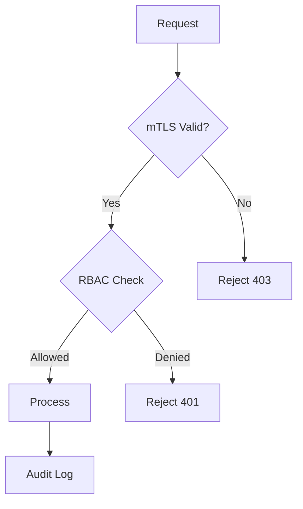

The command-and-control API currently uses bearer tokens over TLS. Regulatory review requires mutual TLS with per-drone client certificates signed by our internal CA. The rollout must be backwards compatible during the migration window.

## Diagram



## Implementation Reference

```go
package telemetry

import (
	"encoding/json"
	"log/slog"
	"net/http"
	"time"
)

type TelemetryFrame struct {
	DroneID    string    `json:"drone_id"`
	Timestamp  time.Time `json:"timestamp"`
	Latitude   float64   `json:"lat"`
	Longitude  float64   `json:"lon"`
	AltitudeMSL float64  `json:"alt_msl"`
	BatteryPct float32   `json:"battery_pct"`
	SpeedKmH   float32   `json:"speed_kmh"`
	FlightMode string    `json:"flight_mode"`
}

func (s *Server) HandleTelemetryIngest(w http.ResponseWriter, r *http.Request) {
	if r.Method != http.MethodPost {
		http.Error(w, "method not allowed", http.StatusMethodNotAllowed)
		return
	}

	var frame TelemetryFrame
	if err := json.NewDecoder(r.Body).Decode(&frame); err != nil {
		slog.Warn("telemetry: invalid payload", "error", err)
		http.Error(w, "bad request", http.StatusBadRequest)
		return
	}

	if frame.DroneID == "" {
		http.Error(w, "missing drone_id", http.StatusUnprocessableEntity)
		return
	}

	frame.Timestamp = time.Now().UTC()
	if err := s.store.InsertFrame(r.Context(), &frame); err != nil {
		slog.Error("telemetry: storage write failed", "drone", frame.DroneID, "error", err)
		http.Error(w, "internal error", http.StatusInternalServerError)
		return
	}

	s.metrics.IngestCounter.Inc()
	w.WriteHeader(http.StatusAccepted)
}
```

## Specification

| Threat | Severity | Mitigation | Status |
| --- | --- | --- | --- |
| Command injection | Critical | mTLS + signing | In Progress |
| Telemetry spoofing | High | HMAC validation | Planned |
| Firmware tampering | Critical | Secure boot | Done |
| Replay attack | High | Nonce + timestamp | In Progress |
| Key extraction | Critical | HSM storage | Planned |

---

> All security-related changes must be reviewed by the security lead before merge. Vulnerability disclosures follow a 90-day responsible disclosure policy. Penetration test results are classified and stored in the restricted security vault.

### Requirements

1. All communications must use TLS 1.3 minimum
2. Client certificates must be rotated every 90 days
3. Failed authentication attempts must trigger alerts after 5 tries
4. Security audit logs must be immutable and retained for 2 years

### Checklist

- [x] Complete threat model for v2 flight controller
- [ ] Implement hardware security module integration
- [x] Set up automated dependency vulnerability scanning
- [ ] Create incident response playbook for drone hijack
- [ ] Audit all API endpoints for authorization gaps

### Project Structure

security/  
├── certs/  
│   ├── ca/  
│   │   ├── root-ca.pem  
│   │   └── intermediate.pem  
│   └── fleet/  
│       └── drone-template.cnf  
├── policies/  
│   ├── rbac.yaml  
│   └── network-policy.yaml  
└── tools/  
    ├── cert-rotate.sh  
    └── audit-scan.sh

See also [IBLJH7](IBLJH7) for related context.
