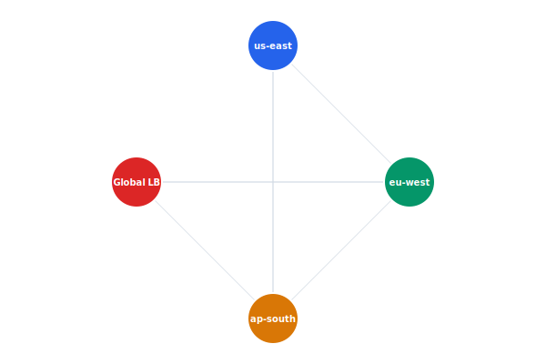

As we expand operations to Europe and Asia, telemetry ingest must be co-located with drone fleets to reduce latency. Reusable Terraform modules will standardize the deployment of NATS, ingest, and TimescaleDB across regions.

## Diagram



## Implementation Reference

```bash
#!/usr/bin/env bash
# deploy-telemetry.sh — rolling deploy of the telemetry ingest service
set -euo pipefail

SERVICE="telemetry-ingest"
CLUSTER="celestia-prod"
REGION="${AWS_REGION:-us-west-2}"
IMAGE_TAG="${1:?Usage: $0 <image-tag>}"

echo "deploying ${SERVICE} image tag: ${IMAGE_TAG}"

# validate image exists in ECR
aws ecr describe-images     --repository-name "celestia/${SERVICE}"     --image-ids "imageTag=${IMAGE_TAG}"     --region "${REGION}" > /dev/null 2>&1     || { echo "error: image tag ${IMAGE_TAG} not found in ECR"; exit 1; }

# update task definition with new image
TASK_DEF=$(aws ecs describe-task-definition     --task-definition "${SERVICE}"     --region "${REGION}"     --query 'taskDefinition'     --output json)

NEW_TASK_DEF=$(echo "${TASK_DEF}"     | jq --arg tag "${IMAGE_TAG}"         '.containerDefinitions[0].image |= sub(":[^:]+$"; ":" + $tag)')

REVISION=$(aws ecs register-task-definition     --region "${REGION}"     --cli-input-json "${NEW_TASK_DEF}"     --query 'taskDefinition.taskDefinitionArn'     --output text)

echo "registered task definition: ${REVISION}"

# rolling update
aws ecs update-service     --cluster "${CLUSTER}"     --service "${SERVICE}"     --task-definition "${REVISION}"     --region "${REGION}"     --no-cli-pager

echo "deploy initiated — waiting for stability..."
aws ecs wait services-stable     --cluster "${CLUSTER}"     --services "${SERVICE}"     --region "${REGION}"

echo "deploy complete"
```

## Specification

| Service | Replicas | CPU Limit | Memory Limit |
| --- | --- | --- | --- |
| telemetry-ingest | 3-10 | 500m | 512Mi |
| api-gateway | 2-5 | 250m | 256Mi |
| mission-service | 2 | 500m | 1Gi |
| nats-server | 3 | 1000m | 2Gi |
| timescaledb | 2 | 2000m | 4Gi |

---

> All infrastructure changes must go through the GitOps pipeline. Direct kubectl apply is prohibited in production. Terraform state is stored in an encrypted S3 backend with DynamoDB locking.

### Requirements

1. Telemetry ingest must sustain 50k messages/sec
2. Database failover must complete within 30 seconds
3. All services must pass health checks within 10s of startup
4. Infrastructure as Code coverage must be 100% for production

### Checklist

- [x] Migrate secrets to HashiCorp Vault
- [ ] Set up cross-region database replication
- [x] Add Prometheus alerts for NATS consumer lag
- [ ] Implement blue-green deployment for API gateway
- [ ] Create disaster recovery runbook

### Project Structure

infrastructure/  
├── terraform/  
│   └── modules/  
│       ├── k8s-cluster/  
│       ├── database/  
│       └── networking/  
└── k8s/  
    ├── base/  
    │   ├── telemetry-ingest.yaml  
    │   └── api-gateway.yaml  
    └── overlays/  
        ├── production/  
        └── staging/
