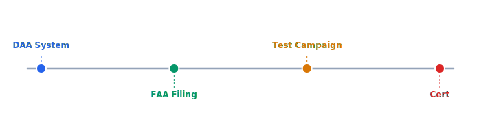

BVLOS operations are the key revenue unlock. This program covers detect-and-avoid system integration, FAA waiver application, a 200-hour test campaign, and final type certification. Expected timeline is 12-18 months.

## Diagram



## Implementation Reference

```dockerfile
FROM golang:1.23-alpine AS builder

RUN apk add --no-cache git ca-certificates

WORKDIR /src
COPY go.mod go.sum ./
RUN go mod download

COPY . .
RUN CGO_ENABLED=0 GOOS=linux GOARCH=amd64 go build     -ldflags="-s -w -X main.version=$(git describe --tags --always)"     -o /bin/telemetry-ingest     ./cmd/telemetry-ingest

FROM gcr.io/distroless/static-debian12:nonroot

COPY --from=builder /bin/telemetry-ingest /usr/local/bin/telemetry-ingest
COPY --from=builder /etc/ssl/certs/ca-certificates.crt /etc/ssl/certs/

EXPOSE 8080 9090

USER nonroot:nonroot
ENTRYPOINT ["telemetry-ingest"]
```

## Specification

| Check Item | Frequency | Owner | Last Completed |
| --- | --- | --- | --- |
| Propeller torque | Pre-flight | Pilot | 2026-03-28 |
| Battery health | Weekly | Ops Lead | 2026-03-24 |
| Firmware version | Pre-flight | Pilot | 2026-03-28 |
| Frame inspection | Monthly | Maintenance | 2026-03-01 |
| Radio range test | Monthly | RF Engineer | 2026-03-15 |

---

> All field operations must follow the standard operating procedure checklist. Deviations require documented justification and approval from the operations director. Equipment returned from the field must be inspected within 24 hours.

### Requirements

1. Pre-flight checklist must be completed and signed before every flight
2. Maintenance records must be linked to individual airframe serial numbers
3. Battery cycle count must be tracked and retired at 300 cycles
4. All incidents must be reported within 24 hours per company policy

### Checklist

- [x] Update pre-flight checklist for v2 hardware
- [ ] Create maintenance scheduling system
- [x] Document battery storage and disposal procedures
- [ ] Build spare parts inventory tracking
- [ ] Automate post-flight log upload and archival
