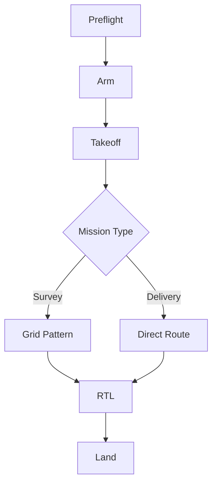

Manual review of flight logs misses subtle degradation patterns. An autoencoder trained on nominal flight data could flag anomalous sensor signatures before they become safety events. This spike evaluates feasibility and data requirements.

## Diagram



## Implementation Reference

```rust
use std::time::{Duration, Instant};

#[derive(Debug, Clone, Copy, PartialEq)]
pub enum FlightState {
    Disarmed,
    PreflightCheck,
    Armed,
    Takeoff,
    Hovering,
    Mission,
    ReturnToHome,
    Landing,
    EmergencyLand,
}

pub struct SafetyMonitor {
    state: FlightState,
    last_heartbeat: Instant,
    battery_voltage: f32,
    altitude_m: f32,
    max_altitude_m: f32,
    geofence_radius_m: f32,
}

impl SafetyMonitor {
    pub fn new(max_alt: f32, geofence: f32) -> Self {
        Self {
            state: FlightState::Disarmed,
            last_heartbeat: Instant::now(),
            battery_voltage: 0.0,
            altitude_m: 0.0,
            max_altitude_m: max_alt,
            geofence_radius_m: geofence,
        }
    }

    pub fn check(&mut self, telemetry: &TelemetryFrame) -> Result<(), SafetyViolation> {
        self.battery_voltage = telemetry.battery_v;
        self.altitude_m = telemetry.alt_msl;

        if self.battery_voltage < 13.2 {
            return Err(SafetyViolation::LowBattery(self.battery_voltage));
        }
        if self.altitude_m > self.max_altitude_m {
            return Err(SafetyViolation::AltitudeBreach(self.altitude_m));
        }
        let distance = telemetry.position.distance_to(&telemetry.home);
        if distance > self.geofence_radius_m {
            return Err(SafetyViolation::GeofenceBreach(distance));
        }
        if self.last_heartbeat.elapsed() > Duration::from_secs(3) {
            return Err(SafetyViolation::HeartbeatLost);
        }

        self.last_heartbeat = Instant::now();
        Ok(())
    }

    pub fn trigger_emergency_land(&mut self) {
        log::warn!("safety: emergency landing triggered from state {:?}", self.state);
        self.state = FlightState::EmergencyLand;
    }
}
```

## Specification

| Parameter | Value | Unit | Tolerance |
| --- | --- | --- | --- |
| Max Airspeed | 22 | m/s | ±0.5 |
| Cruise Altitude | 120 | m AGL | ±2.0 |
| Max Bank Angle | 45 | deg | ±1.0 |
| Descent Rate | 3.0 | m/s | ±0.3 |
| Wind Limit | 12 | m/s | N/A |

---

> All flight controller parameter changes must be validated in SITL before uploading to a physical vehicle. Field-tuning is only permitted under direct supervision of the flight test lead.

### Requirements

1. Attitude control loop must run at 400Hz
2. Position hold accuracy within 0.5m in GPS mode
3. Motor failure detection within 50ms
4. Failsafe must trigger within 1s of lost link

### Checklist

- [x] Validate PID gains for 2.5kg payload config
- [ ] Implement wind rejection feedforward term
- [x] Add altitude hold mode for survey missions
- [ ] Test motor failure response in hexacopter config
- [ ] Calibrate compass interference map for new frame
