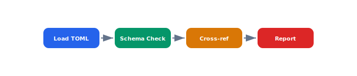

Multiple TOML and YAML config files govern drone behavior, comms, and safety limits. A CLI validator that checks schema conformance and cross-references between files would catch misconfigurations before deployment.

## Diagram



## Implementation Reference

```toml
[package]
name = "celestia-flight-controller"
version = "2.4.1"
edition = "2021"
authors = ["Celestia Robotics <firmware@celestia-robotics.dev>"]
description = "Flight controller firmware for the CX-7 drone platform"

[dependencies]
embedded-hal = "0.2.7"
cortex-m = "0.7.7"
cortex-m-rt = "0.7.3"
heapless = "0.8"
defmt = "0.3"
defmt-rtt = "0.4"
panic-probe = { version = "0.3", features = ["print-defmt"] }

[dependencies.stm32h7xx-hal]
version = "0.16"
features = ["stm32h743v", "rt"]

[profile.release]
opt-level = "s"
lto = true
codegen-units = 1
debug = true  # keep dwarf info for crash analysis

[profile.dev]
opt-level = 1  # minimal optimization to fit in flash during dev

[features]
default = ["imu-icm42688", "gps-ublox"]
imu-icm42688 = []
imu-bmi270 = []
gps-ublox = []
gps-trimble = []
hitl = []  # hardware-in-the-loop testing support
```

## Specification

| Config File | Format | Scope | Hot Reload |
| --- | --- | --- | --- |
| drone.toml | TOML | Per-vehicle | No |
| mission.yaml | YAML | Per-mission | Yes |
| safety.toml | TOML | Global | No |
| comms.toml | TOML | Per-vehicle | Partial |
| fleet.yaml | YAML | Global | Yes |

---

> Configuration changes to safety-critical parameters (geofence limits, failsafe thresholds, motor parameters) require a two-person approval and trigger an automatic regression test suite before deployment.

### Requirements

1. All config files must pass schema validation before loading
2. Safety-critical config changes must be dual-approved
3. Config rollback must be possible within 30 seconds
4. Default values must be documented inline in schema files

### Checklist

- [x] Define JSON Schema for all TOML config files
- [ ] Implement config diff tool for pre-deploy review
- [x] Add config versioning with git-backed history
- [ ] Build web UI for non-engineer config editing
- [ ] Create config migration scripts for v1 to v2 schema

### Project Structure

config/  
├── schemas/  
│   ├── drone.schema.json  
│   ├── mission.schema.json  
│   └── safety.schema.json  
├── defaults/  
│   ├── drone.toml  
│   └── safety.toml  
└── tools/  
    ├── validate.go  
    └── migrate.go
