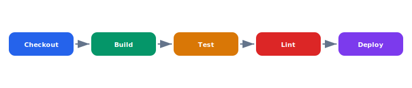

Our Jenkins server is a single point of failure and the Groovy pipeline scripts are difficult to maintain. GitHub Actions will give us matrix builds, better caching, and native integration with our PR workflow.

## Diagram



## Implementation Reference

```dockerfile
FROM golang:1.23-alpine AS builder

RUN apk add --no-cache git ca-certificates

WORKDIR /src
COPY go.mod go.sum ./
RUN go mod download

COPY . .
RUN CGO_ENABLED=0 GOOS=linux GOARCH=amd64 go build     -ldflags="-s -w -X main.version=$(git describe --tags --always)"     -o /bin/telemetry-ingest     ./cmd/telemetry-ingest

FROM gcr.io/distroless/static-debian12:nonroot

COPY --from=builder /bin/telemetry-ingest /usr/local/bin/telemetry-ingest
COPY --from=builder /etc/ssl/certs/ca-certificates.crt /etc/ssl/certs/

EXPOSE 8080 9090

USER nonroot:nonroot
ENTRYPOINT ["telemetry-ingest"]
```

## Specification

| Service | Replicas | CPU Limit | Memory Limit |
| --- | --- | --- | --- |
| telemetry-ingest | 3-10 | 500m | 512Mi |
| api-gateway | 2-5 | 250m | 256Mi |
| mission-service | 2 | 500m | 1Gi |
| nats-server | 3 | 1000m | 2Gi |
| timescaledb | 2 | 2000m | 4Gi |

---

> All infrastructure changes must go through the GitOps pipeline. Direct kubectl apply is prohibited in production. Terraform state is stored in an encrypted S3 backend with DynamoDB locking.

### Requirements

1. Telemetry ingest must sustain 50k messages/sec
2. Database failover must complete within 30 seconds
3. All services must pass health checks within 10s of startup
4. Infrastructure as Code coverage must be 100% for production

### Checklist

- [x] Migrate secrets to HashiCorp Vault
- [ ] Set up cross-region database replication
- [x] Add Prometheus alerts for NATS consumer lag
- [ ] Implement blue-green deployment for API gateway
- [ ] Create disaster recovery runbook

### Project Structure

infrastructure/  
├── terraform/  
│   └── modules/  
│       ├── k8s-cluster/  
│       ├── database/  
│       └── networking/  
└── k8s/  
    ├── base/  
    │   ├── telemetry-ingest.yaml  
    │   └── api-gateway.yaml  
    └── overlays/  
        ├── production/  
        └── staging/

See also [DW2PCN](DW2PCN) for related context.
