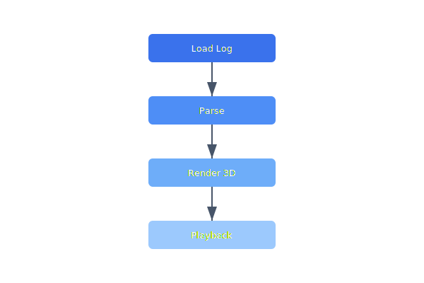

Post-flight analysis is done by reading raw CSV logs. A 3D replay viewer with time scrubbing would dramatically improve debugging and allow operators to visually correlate anomalies with flight events.

## Diagram



## Implementation Reference

```python
import statistics
from dataclasses import dataclass
from datetime import datetime, timezone


@dataclass
class FlightSummary:
    drone_id: str
    flight_start: datetime
    flight_end: datetime
    distance_km: float
    max_altitude_m: float
    avg_speed_kmh: float
    battery_used_pct: float


def compute_flight_summary(
    drone_id: str,
    frames: list[dict],
) -> FlightSummary:
    """Aggregate raw telemetry frames into a single flight summary."""
    if len(frames) < 2:
        raise ValueError(f"need at least 2 frames, got {len(frames)}")

    speeds = [f["speed_kmh"] for f in frames if f["speed_kmh"] is not None]
    altitudes = [f["alt_msl"] for f in frames]
    first, last = frames[0], frames[-1]

    total_distance = sum(
        haversine_km(
            frames[i]["lat"], frames[i]["lon"],
            frames[i + 1]["lat"], frames[i + 1]["lon"],
        )
        for i in range(len(frames) - 1)
    )

    return FlightSummary(
        drone_id=drone_id,
        flight_start=datetime.fromtimestamp(first["ts"], tz=timezone.utc),
        flight_end=datetime.fromtimestamp(last["ts"], tz=timezone.utc),
        distance_km=round(total_distance, 3),
        max_altitude_m=max(altitudes),
        avg_speed_kmh=round(statistics.mean(speeds), 1) if speeds else 0.0,
        battery_used_pct=round(first["battery_pct"] - last["battery_pct"], 1),
    )
```

## Specification

| Feature | Status | Owner | Target |
| --- | --- | --- | --- |
| Live Map | In Progress | jnakamura | Q2 2026 |
| Mission Upload | Done | jnakamura | Q1 2026 |
| Log Download | Planned | spreet | Q2 2026 |
| Multi-Vehicle | Planned | jnakamura | Q3 2026 |
| Replay Viewer | Backlog | spreet | Q3 2026 |

---

> The ground station must function over satellite links with up to 2000ms round-trip latency. All commands must be idempotent, and the UI must clearly indicate stale data when connectivity degrades.

### Requirements

1. UI must render at 30fps minimum during live tracking
2. Command latency must be displayed to the operator
3. Waypoint upload must validate against active geofences
4. Session recovery must restore full state after reconnect

### Checklist

- [x] Implement WebSocket reconnect with sequence replay
- [ ] Add offline map tile caching for field ops
- [x] Build mission plan import/export as GeoJSON
- [ ] Support multi-monitor layout persistence
- [ ] Add dark mode toggle for night operations

See also [PHT0HL](PHT0HL) for related context.
