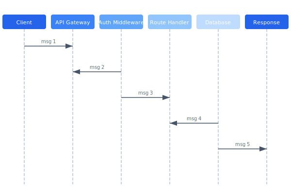

# REST API Reference

The Celestia REST API provides CRUD operations for drones, missions, and fleet management. All endpoints require Bearer token authentication and return JSON responses with standard error envelopes.

## Overview Diagram



---

## Implementation Reference

```json
{
  "drone_id": "CX7-0042",
  "mission_id": "MSN-20260315-0819",
  "status": "inProgress",
  "telemetry": {
    "timestamp": "2026-03-15T08:23:41.003Z",
    "position": {
      "latitude": 37.41589,
      "longitude": -122.07734,
      "altitude_msl": 85.3
    },
    "velocity": {
      "ground_speed_ms": 12.4,
      "vertical_speed_ms": -0.2,
      "heading_deg": 274.1
    },
    "battery": {
      "voltage": 22.1,
      "current_a": 14.6,
      "remaining_pct": 63,
      "temperature_c": 38.2
    },
    "flight_mode": "mission",
    "satellites": 18,
    "fix_type": "rtk_fixed"
  },
  "waypoint_progress": {
    "current": 7,
    "total": 24,
    "distance_to_next_m": 142.8
  }
}
```

---

## Specification

| Endpoint | Method | Auth | Description |
| --- | --- | --- | --- |
| /api/v1/drones | GET | Operator+ | List all drones |
| /api/v1/drones/:id | GET | Operator+ | Get drone details |
| /api/v1/missions | POST | Operator+ | Create mission |
| /api/v1/missions/:id/upload | POST | Operator+ | Upload to drone |
| /api/v1/fleet/status | GET | Viewer+ | Fleet overview |
| /api/v1/admin/users | GET | Admin | List users |

### *Key Policy*

> All API responses must include a request_id header for traceability across distributed services.

## Requirements

1. All endpoints must return responses within 500ms (p99)
2. Rate limiting: 100 requests/minute per API key
3. Error responses must use RFC 7807 Problem Details format
4. Breaking changes require a new API version

## Action Items

- [x] Add OpenAPI 3.0 spec generation
- [x] Implement rate limiting per API key
- [ ] Add pagination to list endpoints
- [ ] Document webhook callbacks
- [x] Set up API versioning strategy

## Project Structure

api/  
├── openapi/  
│   └── celestia-v1.yaml  
├── handlers/  
│   ├── drones.go  
│   ├── missions.go  
│   └── fleet.go  
└── middleware/  
    ├── auth.go  
    └── ratelimit.go

---

## Related Documents

- [Authentication](../security/authentication.md)
- [Ground Station](../engineering/ground-station.md)
- [Data Model](../architecture/data-model.md)
