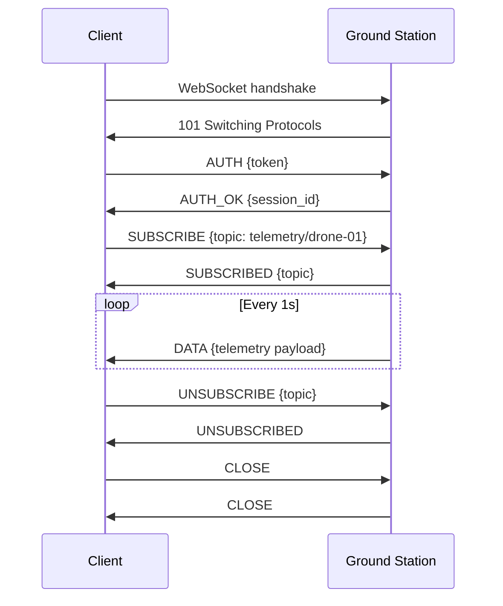

# WebSocket API

The WebSocket API provides real-time bidirectional communication between the fleet dashboard and ground station. Clients subscribe to topics for telemetry streams, alerts, and mission status updates.

## Overview Diagram



---

## Implementation Reference

```go
package telemetry

import (
	"encoding/json"
	"log/slog"
	"net/http"
	"time"
)

type TelemetryFrame struct {
	DroneID    string    `json:"drone_id"`
	Timestamp  time.Time `json:"timestamp"`
	Latitude   float64   `json:"lat"`
	Longitude  float64   `json:"lon"`
	AltitudeMSL float64  `json:"alt_msl"`
	BatteryPct float32   `json:"battery_pct"`
	SpeedKmH   float32   `json:"speed_kmh"`
	FlightMode string    `json:"flight_mode"`
}

func (s *Server) HandleTelemetryIngest(w http.ResponseWriter, r *http.Request) {
	if r.Method != http.MethodPost {
		http.Error(w, "method not allowed", http.StatusMethodNotAllowed)
		return
	}

	var frame TelemetryFrame
	if err := json.NewDecoder(r.Body).Decode(&frame); err != nil {
		slog.Warn("telemetry: invalid payload", "error", err)
		http.Error(w, "bad request", http.StatusBadRequest)
		return
	}

	if frame.DroneID == "" {
		http.Error(w, "missing drone_id", http.StatusUnprocessableEntity)
		return
	}

	frame.Timestamp = time.Now().UTC()
	if err := s.store.InsertFrame(r.Context(), &frame); err != nil {
		slog.Error("telemetry: storage write failed", "drone", frame.DroneID, "error", err)
		http.Error(w, "internal error", http.StatusInternalServerError)
		return
	}

	s.metrics.IngestCounter.Inc()
	w.WriteHeader(http.StatusAccepted)
}
```

---

## Specification

| Topic | Direction | Payload | Rate |
| --- | --- | --- | --- |
| telemetry/:drone_id | Server → Client | Position, battery, speed | 1 Hz |
| alerts | Server → Client | Alert level, message, drone_id | On event |
| mission/:mission_id | Server → Client | Progress, ETA, status | On change |
| command | Client → Server | Command type, parameters | On demand |

### *Key Policy*

> WebSocket connections must authenticate within 5 seconds of handshake or be terminated by the server.

## Requirements

1. Maximum 10,000 concurrent WebSocket connections
2. Message delivery latency must be under 100ms
3. Clients must re-authenticate after token expiry
4. Server must send PING every 30s, close on missed PONG

## Action Items

- [x] Implement topic-based subscription
- [ ] Add WebSocket compression (permessage-deflate)
- [x] Document reconnection backoff strategy
- [ ] Add binary protobuf encoding option
- [x] Implement connection heartbeat ping/pong

---

## Related Documents

- [Ground Station](../engineering/ground-station.md)
- [Fleet Dashboard](../engineering/fleet-dashboard.md)
- [Authentication](../security/authentication.md)
