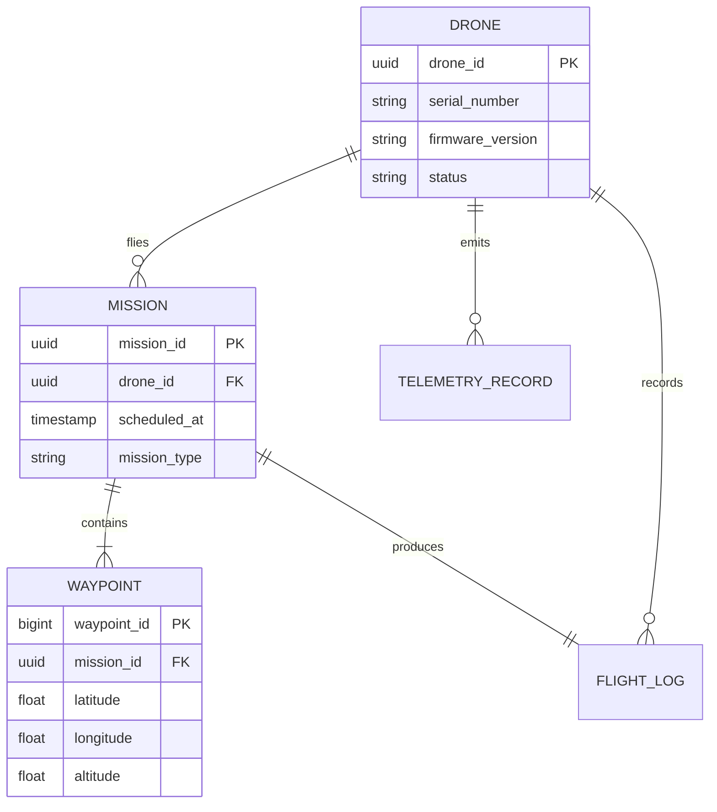

# Data Model

The Celestia fleet database tracks drones, missions, waypoints, and telemetry records. The schema is designed for high write throughput from concurrent telemetry streams while supporting efficient queries for fleet-wide dashboards.

## Overview Diagram



---

## Implementation Reference

```go
package telemetry

import (
	"encoding/json"
	"log/slog"
	"net/http"
	"time"
)

type TelemetryFrame struct {
	DroneID    string    `json:"drone_id"`
	Timestamp  time.Time `json:"timestamp"`
	Latitude   float64   `json:"lat"`
	Longitude  float64   `json:"lon"`
	AltitudeMSL float64  `json:"alt_msl"`
	BatteryPct float32   `json:"battery_pct"`
	SpeedKmH   float32   `json:"speed_kmh"`
	FlightMode string    `json:"flight_mode"`
}

func (s *Server) HandleTelemetryIngest(w http.ResponseWriter, r *http.Request) {
	if r.Method != http.MethodPost {
		http.Error(w, "method not allowed", http.StatusMethodNotAllowed)
		return
	}

	var frame TelemetryFrame
	if err := json.NewDecoder(r.Body).Decode(&frame); err != nil {
		slog.Warn("telemetry: invalid payload", "error", err)
		http.Error(w, "bad request", http.StatusBadRequest)
		return
	}

	if frame.DroneID == "" {
		http.Error(w, "missing drone_id", http.StatusUnprocessableEntity)
		return
	}

	frame.Timestamp = time.Now().UTC()
	if err := s.store.InsertFrame(r.Context(), &frame); err != nil {
		slog.Error("telemetry: storage write failed", "drone", frame.DroneID, "error", err)
		http.Error(w, "internal error", http.StatusInternalServerError)
		return
	}

	s.metrics.IngestCounter.Inc()
	w.WriteHeader(http.StatusAccepted)
}
```

---

## Specification

| Entity | Primary Key | Avg Row Size | Retention |
| --- | --- | --- | --- |
| Drone | drone_id (UUID) | 512 bytes | Permanent |
| Mission | mission_id (UUID) | 2 KB | 1 year |
| Waypoint | waypoint_id (BIGINT) | 256 bytes | 1 year |
| TelemetryRecord | ts + drone_id | 128 bytes | 90 days |
| FlightLog | flight_id (UUID) | 4 KB | Permanent |

### *Key Policy*

> Telemetry tables are partitioned by day and retained for 90 days before archival to cold storage.

## Requirements

1. Write throughput must sustain 10,000 telemetry inserts/s
2. Dashboard queries must return within 500ms for 1M rows
3. All schema changes must be applied via versioned migrations
4. Backups must run every 6 hours with point-in-time recovery

## Action Items

- [x] Add TimescaleDB hypertable for telemetry
- [x] Create composite index on (drone_id, ts)
- [ ] Implement cold-storage archival job
- [ ] Add schema migration tooling
- [x] Document backup and restore procedure

---

## Related Documents

- [Telemetry Pipeline](../engineering/telemetry-pipeline.md)
- [REST API](../api/rest-api.md)
- [Fleet Dashboard](../engineering/fleet-dashboard.md)
