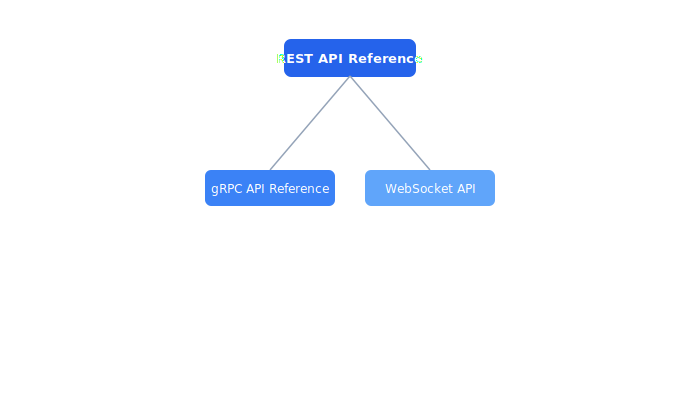

# API

API reference documentation for all Celestia platform services.

## Contents

| Document | Description |
| --- | --- |
| [REST API Reference](rest-api.md) | The Celestia REST API provides CRUD operations for drones, missions, and fleet m... |
| [gRPC API Reference](grpc-api.md) | Internal service-to-service communication uses gRPC with Protocol Buffers. The s... |
| [WebSocket API](websocket-api.md) | The WebSocket API provides real-time bidirectional communication between the fle... |

## Section Overview

