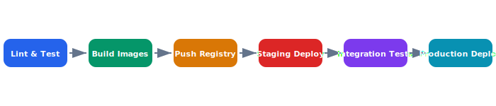

# Deployment Guide

Celestia services are deployed as containers on a Kubernetes cluster with Helm charts managing configuration per environment. The CI/CD pipeline enforces automated testing gates before any production rollout.

## Overview Diagram



---

## Implementation Reference

```protobuf
syntax = "proto3";

package celestia.telemetry.v1;

option go_package = "github.com/celestia-robotics/api/telemetry/v1;telemetryv1";

message GeoPoint {
  double latitude  = 1;
  double longitude = 2;
  float  altitude_msl = 3;  // meters above sea level
}

message TelemetryFrame {
  string    drone_id      = 1;
  int64     timestamp_us  = 2;  // microseconds since epoch
  GeoPoint  position      = 3;
  float     speed_ms      = 4;
  float     heading_deg   = 5;
  float     battery_v     = 6;
  float     battery_pct   = 7;
  FlightMode flight_mode  = 8;
  IMUData   imu           = 9;
}

enum FlightMode {
  FLIGHT_MODE_UNSPECIFIED  = 0;
  FLIGHT_MODE_DISARMED     = 1;
  FLIGHT_MODE_ARMED        = 2;
  FLIGHT_MODE_TAKEOFF      = 3;
  FLIGHT_MODE_HOVER        = 4;
  FLIGHT_MODE_MISSION      = 5;
  FLIGHT_MODE_RTH          = 6;
  FLIGHT_MODE_LANDING      = 7;
  FLIGHT_MODE_EMERGENCY    = 8;
}

message IMUData {
  float accel_x = 1;
  float accel_y = 2;
  float accel_z = 3;
  float gyro_x  = 4;
  float gyro_y  = 5;
  float gyro_z  = 6;
}

message DroneCommand {
  string           drone_id   = 1;
  int64            issued_at  = 2;
  oneof command {
    GotoCommand    go_to      = 3;
    LandCommand    land       = 4;
    RTHCommand     rth        = 5;
    HoverCommand   hover      = 6;
  }
}

message GotoCommand {
  GeoPoint target   = 1;
  float    speed_ms = 2;
}

message LandCommand {}
message RTHCommand  {}
message HoverCommand { float altitude_m = 1; }
```

---

## Specification

| Environment | Cluster | Replicas | Auto-Scale |
| --- | --- | --- | --- |
| Development | dev-k8s-us-west | 1 | No |
| Staging | stg-k8s-us-west | 2 | Yes (2-4) |
| Production US | prd-k8s-us-west | 3 | Yes (3-10) |
| Production EU | prd-k8s-eu-central | 3 | Yes (3-10) |
| DR | dr-k8s-us-east | 1 | No |

### *Key Policy*

> No deployment to production is permitted without passing the full integration test suite and a manual approval gate.

## Requirements

1. Zero-downtime deployments via rolling update strategy
2. All secrets managed through HashiCorp Vault
3. Container images must be signed and scanned before push
4. Rollback must complete within 5 minutes
5. DR failover must achieve RTO < 15 minutes

## Action Items

- [x] Set up Helm chart templating
- [x] Configure horizontal pod autoscaler
- [ ] Add canary deployment support
- [ ] Implement blue-green rollback strategy
- [x] Document DR failover procedure

## Project Structure

deploy/  
├── helm/  
│   ├── flight-controller/  
│   ├── ground-station/  
│   └── fleet-manager/  
├── terraform/  
│   ├── modules/  
│   └── environments/  
└── scripts/  
    ├── rollback.sh  
    └── health-check.sh

---

## Related Documents

- [System Overview](../architecture/system-overview.md)
- [Dev Setup](../onboarding/dev-setup.md)
- [Field Testing](../operations/field-testing.md)
