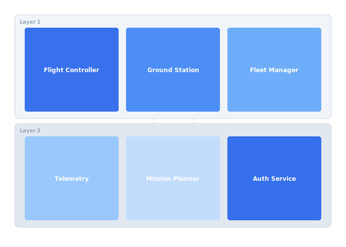

# System Overview

The Celestia platform comprises six core services that coordinate autonomous drone operations. Each service is independently deployable and communicates through well-defined APIs. The architecture favours eventual consistency to tolerate intermittent radio links.

## Overview Diagram



---

## Implementation Reference

```go
package telemetry

import (
	"encoding/json"
	"log/slog"
	"net/http"
	"time"
)

type TelemetryFrame struct {
	DroneID    string    `json:"drone_id"`
	Timestamp  time.Time `json:"timestamp"`
	Latitude   float64   `json:"lat"`
	Longitude  float64   `json:"lon"`
	AltitudeMSL float64  `json:"alt_msl"`
	BatteryPct float32   `json:"battery_pct"`
	SpeedKmH   float32   `json:"speed_kmh"`
	FlightMode string    `json:"flight_mode"`
}

func (s *Server) HandleTelemetryIngest(w http.ResponseWriter, r *http.Request) {
	if r.Method != http.MethodPost {
		http.Error(w, "method not allowed", http.StatusMethodNotAllowed)
		return
	}

	var frame TelemetryFrame
	if err := json.NewDecoder(r.Body).Decode(&frame); err != nil {
		slog.Warn("telemetry: invalid payload", "error", err)
		http.Error(w, "bad request", http.StatusBadRequest)
		return
	}

	if frame.DroneID == "" {
		http.Error(w, "missing drone_id", http.StatusUnprocessableEntity)
		return
	}

	frame.Timestamp = time.Now().UTC()
	if err := s.store.InsertFrame(r.Context(), &frame); err != nil {
		slog.Error("telemetry: storage write failed", "drone", frame.DroneID, "error", err)
		http.Error(w, "internal error", http.StatusInternalServerError)
		return
	}

	s.metrics.IngestCounter.Inc()
	w.WriteHeader(http.StatusAccepted)
}
```

---

## Specification

| Service | Language | Port | Protocol |
| --- | --- | --- | --- |
| Flight Controller | Rust | 8080 | gRPC |
| Ground Station | Go | 8081 | REST+WS |
| Fleet Manager | Go | 8082 | gRPC |
| Telemetry Ingest | Rust | 8083 | UDP+Protobuf |
| Mission Planner | Python | 8084 | REST |
| Auth Service | Go | 8085 | gRPC |

### *Key Policy*

> All inter-service communication uses mTLS with certificate rotation every 24 hours.

## Requirements

1. All services must support graceful shutdown within 30s
2. Service discovery via Consul with health checks every 10s
3. Maximum end-to-end command latency of 200ms over LTE
4. Each service must expose a /healthz endpoint

## Action Items

- [x] Define service mesh topology
- [ ] Add circuit breaker configuration
- [x] Document failover behaviour for radio loss
- [ ] Benchmark gRPC streaming under 500 drones
- [ ] Evaluate switch from REST to gRPC for Mission Planner

## Project Structure

celestia-platform/  
├── services/  
│   ├── flight-controller/  
│   ├── ground-station/  
│   ├── fleet-manager/  
│   ├── telemetry/  
│   ├── mission-planner/  
│   └── auth/  
├── proto/  
└── deploy/

---

## Related Documents

- [Deployment Guide](../architecture/deployment.md)
- [Firmware Details](../engineering/firmware.md)
- [gRPC API Reference](../api/grpc-api.md)
