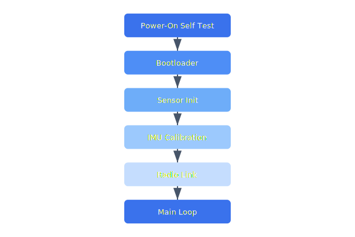

# Firmware Architecture

The Celestia flight firmware runs on an STM32H7 microcontroller with a real-time operating system. The boot sequence performs hardware validation, sensor calibration, and radio link establishment before entering the main control loop.

## Overview Diagram



---

## Implementation Reference

```python
import statistics
from dataclasses import dataclass
from datetime import datetime, timezone


@dataclass
class FlightSummary:
    drone_id: str
    flight_start: datetime
    flight_end: datetime
    distance_km: float
    max_altitude_m: float
    avg_speed_kmh: float
    battery_used_pct: float


def compute_flight_summary(
    drone_id: str,
    frames: list[dict],
) -> FlightSummary:
    """Aggregate raw telemetry frames into a single flight summary."""
    if len(frames) < 2:
        raise ValueError(f"need at least 2 frames, got {len(frames)}")

    speeds = [f["speed_kmh"] for f in frames if f["speed_kmh"] is not None]
    altitudes = [f["alt_msl"] for f in frames]
    first, last = frames[0], frames[-1]

    total_distance = sum(
        haversine_km(
            frames[i]["lat"], frames[i]["lon"],
            frames[i + 1]["lat"], frames[i + 1]["lon"],
        )
        for i in range(len(frames) - 1)
    )

    return FlightSummary(
        drone_id=drone_id,
        flight_start=datetime.fromtimestamp(first["ts"], tz=timezone.utc),
        flight_end=datetime.fromtimestamp(last["ts"], tz=timezone.utc),
        distance_km=round(total_distance, 3),
        max_altitude_m=max(altitudes),
        avg_speed_kmh=round(statistics.mean(speeds), 1) if speeds else 0.0,
        battery_used_pct=round(first["battery_pct"] - last["battery_pct"], 1),
    )
```

---

## Specification

| Sensor | Interface | Sample Rate | Resolution |
| --- | --- | --- | --- |
| IMU (BMI088) | SPI | 1 kHz | 16-bit |
| Barometer (BMP390) | I2C | 100 Hz | 24-bit |
| GPS (u-blox M9N) | UART | 10 Hz | 1 cm CEP |
| Magnetometer (LIS3MDL) | I2C | 100 Hz | 16-bit |
| Optical Flow (PMW3901) | SPI | 200 Hz | 35×35 px |

### *Key Policy*

> Firmware updates must be cryptographically signed and support atomic rollback on verification failure.

## Requirements

1. Main control loop must execute within 1ms deadline
2. Boot-to-ready time must be under 8 seconds
3. Firmware binary must fit within 1 MB flash partition
4. All sensor reads must have timeout and fallback values

## Action Items

- [x] Implement dual-bank OTA update
- [ ] Add watchdog timer for main loop
- [x] Document sensor fusion algorithm
- [ ] Benchmark IMU + baro fusion at 1 kHz
- [ ] Port optical flow driver to new hardware rev

## Project Structure

firmware/  
├── src/  
│   ├── hal/  
│   ├── drivers/  
│   ├── control/  
│   └── comms/  
├── include/  
├── tests/  
└── CMakeLists.txt

---

## Related Documents

- [Drone States](../architecture/drone-states.md)
- [Manufacturing](../operations/manufacturing.md)
- [Threat Model](../security/threat-model.md)
