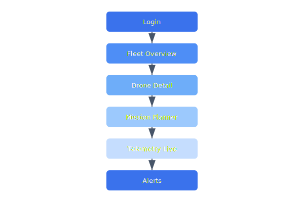

# Fleet Dashboard

The fleet dashboard provides operators with a real-time view of all drones, their positions, battery levels, and mission progress. It is built as a React SPA communicating with the ground station API.

## Overview Diagram



---

## Implementation Reference

```c
#include "celestia/drivers/imu.h"
#include "celestia/hal/gpio.h"
#include <stdint.h>
#include <string.h>

#define IMU_I2C_ADDR      0x68
#define ACCEL_XOUT_H      0x3B
#define GYRO_CONFIG_REG   0x1B
#define SAMPLE_RATE_HZ    400

static imu_reading_t last_reading;
static uint32_t read_count;

int imu_init(i2c_bus_t *bus) {
    // configure gyro for +-2000 deg/s full scale
    uint8_t gyro_cfg = 0x18;
    if (i2c_write_reg(bus, IMU_I2C_ADDR, GYRO_CONFIG_REG, &gyro_cfg, 1) != 0) {
        log_error("imu: failed to set gyro config");
        return -1;
    }

    // enable data-ready interrupt on GPIO pin 7
    gpio_config_t irq_pin = {
        .pin    = 7,
        .mode   = GPIO_MODE_INPUT,
        .pull   = GPIO_PULL_UP,
        .irq    = GPIO_IRQ_FALLING,
    };
    gpio_configure(&irq_pin);
    gpio_attach_isr(irq_pin.pin, imu_data_ready_isr);

    memset(&last_reading, 0, sizeof(last_reading));
    read_count = 0;
    log_info("imu: initialized at %d Hz on bus %d", SAMPLE_RATE_HZ, bus->id);
    return 0;
}

void imu_data_ready_isr(void) {
    uint8_t raw[14];
    i2c_read_burst(NULL, IMU_I2C_ADDR, ACCEL_XOUT_H, raw, sizeof(raw));

    last_reading.accel_x = (int16_t)(raw[0] << 8 | raw[1]);
    last_reading.accel_y = (int16_t)(raw[2] << 8 | raw[3]);
    last_reading.accel_z = (int16_t)(raw[4] << 8 | raw[5]);
    last_reading.gyro_x  = (int16_t)(raw[8] << 8 | raw[9]);
    last_reading.gyro_y  = (int16_t)(raw[10] << 8 | raw[11]);
    last_reading.gyro_z  = (int16_t)(raw[12] << 8 | raw[13]);
    last_reading.timestamp_us = timer_micros();
    read_count++;
}
```

---

## Specification

| View | Refresh Rate | Data Source | Access Level |
| --- | --- | --- | --- |
| Fleet Map | 1s | WebSocket | Operator |
| Drone Detail | 500ms | WebSocket | Operator |
| Mission Queue | 5s | REST poll | Operator |
| Alert Console | Real-time | WebSocket | All |
| Admin Panel | On demand | REST | Admin |

### *Key Policy*

> Dashboard latency from telemetry event to screen update must not exceed 500ms.

## Requirements

1. Must support 200 concurrent operator sessions
2. Fleet map must handle 1000 drone markers without frame drops
3. Alert sounds must be distinguishable for critical vs warning
4. Session timeout after 30 minutes of inactivity

## Action Items

- [x] Implement fleet map with clustering
- [ ] Add historical flight path replay
- [x] Build alert notification system
- [ ] Optimize WebSocket payload compression
- [ ] Add dark mode theme support

---

## Related Documents

- [Ground Station](../engineering/ground-station.md)
- [REST API](../api/rest-api.md)
- [Data Model](../architecture/data-model.md)
