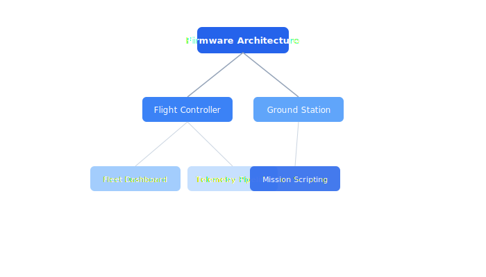

# Engineering

Engineering guides and component documentation for the Celestia drone platform.

## Contents

| Document | Description |
| --- | --- |
| [Firmware Architecture](firmware.md) | The Celestia flight firmware runs on an STM32H7 microcontroller with a real-time... |
| [Flight Controller](flight-controller.md) | The flight controller implements a cascaded PID architecture that translates hig... |
| [Ground Station](ground-station.md) | The ground station software manages mission upload, real-time telemetry display,... |
| [Fleet Dashboard](fleet-dashboard.md) | The fleet dashboard provides operators with a real-time view of all drones, thei... |
| [Telemetry Pipeline](telemetry-pipeline.md) | The telemetry pipeline ingests high-frequency sensor data from the drone fleet, ... |
| [Mission Scripting](mission-scripting.md) | Operators define autonomous missions using a Lua-based scripting DSL. Scripts ar... |

## Section Overview

