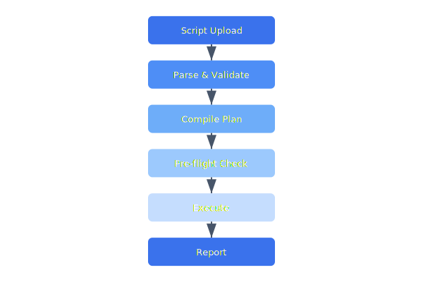

# Mission Scripting

Operators define autonomous missions using a Lua-based scripting DSL. Scripts are validated against safety constraints, compiled into waypoint plans, and uploaded to drones for execution.

## Overview Diagram



---

## Implementation Reference

```typescript
import React, { useEffect, useState } from "react";

interface DroneStatus {
  droneId: string;
  batteryPct: number;
  flightMode: string;
  altitudeM: number;
  speedKmh: number;
  lastSeen: string;
}

interface FleetOverviewProps {
  refreshIntervalMs?: number;
}

export const FleetOverview: React.FC<FleetOverviewProps> = ({
  refreshIntervalMs = 5000,
}) => {
  const [drones, setDrones] = useState<DroneStatus[]>([]);
  const [error, setError] = useState<string | null>(null);

  useEffect(() => {
    const fetchFleet = async () => {
      try {
        const res = await fetch("/api/v1/fleet/status");
        if (!res.ok) throw new Error(`HTTP ${res.status}`);
        const data: DroneStatus[] = await res.json();
        setDrones(data.sort((a, b) => a.droneId.localeCompare(b.droneId)));
        setError(null);
      } catch (err) {
        setError(err instanceof Error ? err.message : "unknown error");
      }
    };

    fetchFleet();
    const interval = setInterval(fetchFleet, refreshIntervalMs);
    return () => clearInterval(interval);
  }, [refreshIntervalMs]);

  if (error) return <div className="fleet-error">Fleet data unavailable: {error}</div>;

  return (
    <div className="fleet-grid">
      {drones.map((d) => (
        <DroneCard key={d.droneId} drone={d} />
      ))}
    </div>
  );
};
```

---

## Specification

| API Function | Description | Safety Check | Example |
| --- | --- | --- | --- |
| goto(lat, lon, alt) | Navigate to waypoint | Geofence | goto(37.7, -122.4, 50) |
| hover(duration) | Hold position | Max duration | hover(30) |
| take_photo() | Trigger camera | Storage check | take_photo() |
| set_speed(m_s) | Set cruise speed | Max speed limit | set_speed(12) |
| land() | Initiate landing | Altitude check | land() |

### *Key Policy*

> Mission scripts must be deterministic — the same script with the same inputs must always produce the same flight plan.

## Requirements

1. Scripts must execute in a sandboxed Lua environment
2. Maximum script execution time: 500ms for plan generation
3. All waypoints must pass geofence validation
4. Scripts must declare expected battery consumption

## Action Items

- [x] Implement Lua sandbox environment
- [ ] Add script version control integration
- [x] Build visual script editor prototype
- [ ] Document all safety constraint checks
- [ ] Add support for conditional waypoints

## Project Structure

mission-scripting/  
├── lua/  
│   ├── stdlib/  
│   └── safety/  
├── compiler/  
└── examples/  
    ├── survey.lua  
    ├── inspection.lua  
    └── delivery.lua

---

## Related Documents

- [Ground Station](../engineering/ground-station.md)
- [Flight Controller](../engineering/flight-controller.md)
- [REST API](../api/rest-api.md)
