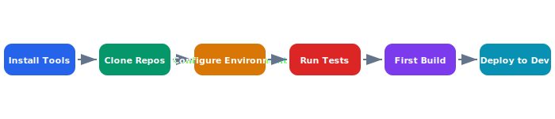

# Developer Setup

This guide walks new developers through setting up their local environment for Celestia development. Follow each step in order — later steps depend on earlier ones completing successfully.

## Overview Diagram



---

## Implementation Reference

```toml
[package]
name = "celestia-flight-controller"
version = "2.4.1"
edition = "2021"
authors = ["Celestia Robotics <firmware@celestia-robotics.dev>"]
description = "Flight controller firmware for the CX-7 drone platform"

[dependencies]
embedded-hal = "0.2.7"
cortex-m = "0.7.7"
cortex-m-rt = "0.7.3"
heapless = "0.8"
defmt = "0.3"
defmt-rtt = "0.4"
panic-probe = { version = "0.3", features = ["print-defmt"] }

[dependencies.stm32h7xx-hal]
version = "0.16"
features = ["stm32h743v", "rt"]

[profile.release]
opt-level = "s"
lto = true
codegen-units = 1
debug = true  # keep dwarf info for crash analysis

[profile.dev]
opt-level = 1  # minimal optimization to fit in flash during dev

[features]
default = ["imu-icm42688", "gps-ublox"]
imu-icm42688 = []
imu-bmi270 = []
gps-ublox = []
gps-trimble = []
hitl = []  # hardware-in-the-loop testing support
```

---

## Specification

| Tool | Version | Install Method | Required |
| --- | --- | --- | --- |
| Go | 1.22+ | brew / asdf | Yes |
| Rust | 1.76+ | rustup | Yes |
| Node.js | 20 LTS | nvm | Dashboard only |
| Docker | 25+ | Docker Desktop | Yes |
| kubectl | 1.29+ | brew | Yes |
| Helm | 3.14+ | brew | Yes |

### *Key Policy*

> Do not skip the test step. If tests fail on a fresh setup, file a bug immediately — the main branch must always be green.

## Requirements

1. Setup must complete within 30 minutes on a clean machine
2. All required tools must be version-pinned
3. Setup script must be idempotent
4. Verification command must check all dependencies

## Action Items

- [x] Write automated setup script
- [x] Test setup on macOS and Ubuntu
- [ ] Add Windows/WSL setup instructions
- [ ] Create setup verification checklist command

## Project Structure

celestia-platform/  
├── services/  
├── proto/  
├── deploy/  
├── tools/  
│   ├── setup.sh  
│   └── verify.sh  
├── Makefile  
└── docker-compose.yaml

---

## Related Documents

- [Deployment Guide](../architecture/deployment.md)
- [Coding Standards](../onboarding/coding-standards.md)
- [Team Structure](../onboarding/team-structure.md)
