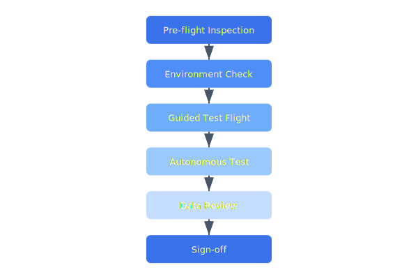

# Field Testing Procedures

Field testing validates drone behaviour in real-world conditions before fleet deployment. Each test campaign follows a structured protocol covering manual flight, autonomous missions, and edge-case scenarios.

## Overview Diagram



---

## Implementation Reference

```dockerfile
FROM golang:1.23-alpine AS builder

RUN apk add --no-cache git ca-certificates

WORKDIR /src
COPY go.mod go.sum ./
RUN go mod download

COPY . .
RUN CGO_ENABLED=0 GOOS=linux GOARCH=amd64 go build     -ldflags="-s -w -X main.version=$(git describe --tags --always)"     -o /bin/telemetry-ingest     ./cmd/telemetry-ingest

FROM gcr.io/distroless/static-debian12:nonroot

COPY --from=builder /bin/telemetry-ingest /usr/local/bin/telemetry-ingest
COPY --from=builder /etc/ssl/certs/ca-certificates.crt /etc/ssl/certs/

EXPOSE 8080 9090

USER nonroot:nonroot
ENTRYPOINT ["telemetry-ingest"]
```

---

## Specification

| Test Phase | Duration | Pass Criteria | Required Conditions |
| --- | --- | --- | --- |
| Pre-flight inspection | 10 min | All checks green | N/A |
| Manual hover test | 5 min | Stable within 0.5m | Wind < 15 km/h |
| Waypoint accuracy | 15 min | CEP < 1m | GPS PDOP < 2.0 |
| RTH test | 10 min | Lands within 2m of home | GPS lock |
| Battery endurance | 25 min | Matches predicted flight time ±10% | Ambient > 5°C |

### *Key Policy*

> Field tests must be conducted with a safety observer who has authority to trigger emergency landing at any time.

## Requirements

1. All test flights must be logged with GPS tracks and telemetry
2. Safety observer must be FAA Part 107 certified
3. Test area must have 50m clearance from obstacles
4. Battery must be above 80% at test start

## Action Items

- [x] Create standardized field test checklist
- [ ] Build automated test report generator
- [x] Define wind-limit testing protocol
- [ ] Add GPS-denied navigation test
- [ ] Document emergency procedures for test sites

## Project Structure

field-testing/  
├── checklists/  
│   ├── pre-flight.yaml  
│   └── post-flight.yaml  
├── reports/  
└── scripts/  
    ├── analyze_flight.py  
    └── generate_report.py

---

## Related Documents

- [Flight Controller](../engineering/flight-controller.md)
- [Drone States](../architecture/drone-states.md)
- [Maintenance](../operations/maintenance.md)
