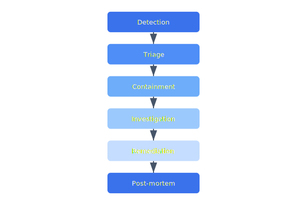

# Incident Response

The incident response plan defines how the Celestia team handles drone malfunctions, security breaches, and safety events. Every incident is classified by severity and follows a structured response workflow.

## Overview Diagram



---

## Implementation Reference

```yaml
apiVersion: apps/v1
kind: Deployment
metadata:
  name: telemetry-ingest
  namespace: celestia
  labels:
    app: telemetry-ingest
    team: platform
spec:
  replicas: 3
  strategy:
    type: RollingUpdate
    rollingUpdate:
      maxSurge: 1
      maxUnavailable: 0
  selector:
    matchLabels:
      app: telemetry-ingest
  template:
    metadata:
      labels:
        app: telemetry-ingest
      annotations:
        prometheus.io/scrape: "true"
        prometheus.io/port: "9090"
    spec:
      serviceAccountName: telemetry-ingest
      containers:
        - name: ingest
          image: 123456789.dkr.ecr.us-west-2.amazonaws.com/celestia/telemetry-ingest:latest
          ports:
            - containerPort: 8080
              name: http
            - containerPort: 9090
              name: metrics
          env:
            - name: DB_HOST
              valueFrom:
                secretKeyRef:
                  name: telemetry-db
                  key: host
            - name: LOG_LEVEL
              value: "info"
          resources:
            requests:
              cpu: 250m
              memory: 256Mi
            limits:
              cpu: "1"
              memory: 512Mi
          livenessProbe:
            httpGet:
              path: /healthz
              port: http
            initialDelaySeconds: 5
          readinessProbe:
            httpGet:
              path: /readyz
              port: http
```

---

## Specification

| Severity | Response Time | Escalation | Example |
| --- | --- | --- | --- |
| P0 — Critical | 15 min | CTO + Safety Officer | Drone crash / injury |
| P1 — High | 1 hour | Engineering Lead | Fleet-wide comm loss |
| P2 — Medium | 4 hours | On-call engineer | Single drone RTH failure |
| P3 — Low | Next business day | Team queue | Telemetry data gap |

### *Key Policy*

> Any incident involving physical risk to people must be reported to the safety officer within 15 minutes.

## Requirements

1. All P0 incidents must have a published post-mortem within 5 business days
2. Incident response runbooks must be tested quarterly
3. FAA must be notified within 10 days for reportable incidents
4. All incidents must be tracked in the incident database

## Action Items

- [x] Define on-call rotation schedule
- [x] Create incident severity classification guide
- [ ] Build automated alert escalation
- [ ] Conduct tabletop exercise for P0 scenario
- [ ] Set up post-mortem template repository

---

## Related Documents

- [Threat Model](../security/threat-model.md)
- [Drone States](../architecture/drone-states.md)
- [Maintenance](../operations/maintenance.md)
