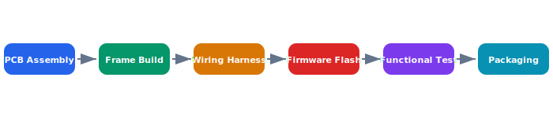

# Manufacturing Process

Each Celestia drone goes through a six-stage manufacturing pipeline from bare PCB to packaged unit. Every stage has quality gates with automated test fixtures to catch defects early.

## Overview Diagram



---

## Implementation Reference

```yaml
apiVersion: apps/v1
kind: Deployment
metadata:
  name: telemetry-ingest
  namespace: celestia
  labels:
    app: telemetry-ingest
    team: platform
spec:
  replicas: 3
  strategy:
    type: RollingUpdate
    rollingUpdate:
      maxSurge: 1
      maxUnavailable: 0
  selector:
    matchLabels:
      app: telemetry-ingest
  template:
    metadata:
      labels:
        app: telemetry-ingest
      annotations:
        prometheus.io/scrape: "true"
        prometheus.io/port: "9090"
    spec:
      serviceAccountName: telemetry-ingest
      containers:
        - name: ingest
          image: 123456789.dkr.ecr.us-west-2.amazonaws.com/celestia/telemetry-ingest:latest
          ports:
            - containerPort: 8080
              name: http
            - containerPort: 9090
              name: metrics
          env:
            - name: DB_HOST
              valueFrom:
                secretKeyRef:
                  name: telemetry-db
                  key: host
            - name: LOG_LEVEL
              value: "info"
          resources:
            requests:
              cpu: 250m
              memory: 256Mi
            limits:
              cpu: "1"
              memory: 512Mi
          livenessProbe:
            httpGet:
              path: /healthz
              port: http
            initialDelaySeconds: 5
          readinessProbe:
            httpGet:
              path: /readyz
              port: http
```

---

## Specification

| Stage | Duration | Yield Target | Key Equipment |
| --- | --- | --- | --- |
| PCB Assembly | 15 min | 99.5% | Pick-and-place machine |
| Frame Build | 20 min | 99.8% | Torque-calibrated tools |
| Wiring Harness | 10 min | 99.2% | Continuity tester |
| Firmware Flash | 3 min | 99.9% | JTAG programmer |
| Functional Test | 30 min | 98.5% | Test jig + load cells |
| Packaging | 5 min | 99.9% | ESD-safe packaging line |

### *Key Policy*

> No drone may proceed to the next manufacturing stage without passing all quality gate tests.

## Requirements

1. Overall manufacturing yield must exceed 97%
2. Every unit must have a unique serial number and traceability record
3. Firmware version must be recorded at flash time
4. Functional test must validate all sensor readings within spec
5. ESD precautions must be observed at all stages

## Action Items

- [x] Design automated PCB test fixture
- [x] Order new pick-and-place feeders
- [ ] Reduce wiring harness assembly time by 20%
- [ ] Add vibration testing to functional test stage
- [x] Document rework procedures for common defects

---

## Related Documents

- [Firmware Architecture](../engineering/firmware.md)
- [Field Testing](../operations/field-testing.md)
- [Compliance](../security/compliance.md)
