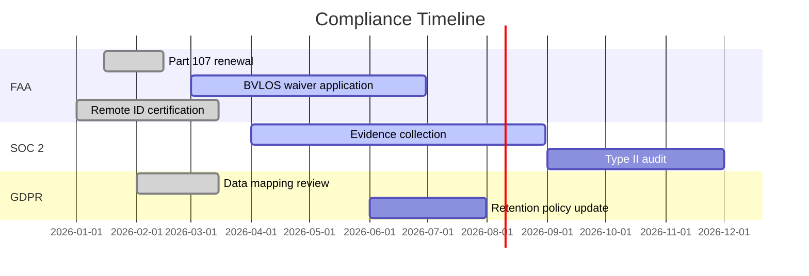

# Compliance & Regulatory

Celestia operates under FAA Part 107 regulations and pursues BVLOS waivers for extended autonomous operations. This document tracks compliance milestones and audit readiness.

## Overview Diagram



---

## Implementation Reference

```hcl
resource "aws_ecs_service" "telemetry_ingest" {
  name            = "telemetry-ingest"
  cluster         = aws_ecs_cluster.celestia.id
  task_definition = aws_ecs_task_definition.telemetry_ingest.arn
  desired_count   = 3
  launch_type     = "FARGATE"

  network_configuration {
    subnets          = var.private_subnet_ids
    security_groups  = [aws_security_group.telemetry_ingest.id]
    assign_public_ip = false
  }

  load_balancer {
    target_group_arn = aws_lb_target_group.telemetry_ingest.arn
    container_name   = "ingest"
    container_port   = 8080
  }
}

resource "aws_security_group" "telemetry_ingest" {
  name_prefix = "telemetry-ingest-"
  vpc_id      = var.vpc_id

  ingress {
    from_port       = 8080
    to_port         = 8080
    protocol        = "tcp"
    security_groups = [aws_security_group.alb.id]
  }

  egress {
    from_port   = 0
    to_port     = 0
    protocol    = "-1"
    cidr_blocks = ["0.0.0.0/0"]
  }

  tags = {
    Service     = "telemetry-ingest"
    Environment = var.environment
    ManagedBy   = "terraform"
  }
}

resource "aws_cloudwatch_log_group" "telemetry_ingest" {
  name              = "/ecs/celestia/telemetry-ingest"
  retention_in_days = 30

  tags = {
    Service = "telemetry-ingest"
  }
}
```

---

## Specification

| Regulation | Status | Renewal Date | Owner |
| --- | --- | --- | --- |
| FAA Part 107 | Active | 2027-01-15 | Operations |
| BVLOS Waiver | Pending | N/A | Legal |
| Remote ID | Compliant | 2026-09-01 | Engineering |
| SOC 2 Type II | In Progress | 2026-12-01 | Security |
| GDPR (telemetry data) | Compliant | 2027-03-01 | Legal |

### *Key Policy*

> Compliance is not optional — every flight must have a valid COA or Part 107 waiver on file.

## Requirements

1. All flight operations must have valid FAA authorization
2. Telemetry data containing PII must be anonymized within 30 days
3. SOC 2 evidence must be continuously collected, not point-in-time
4. Remote ID broadcast must be active for every airborne drone

## Action Items

- [x] Submit BVLOS waiver application
- [ ] Complete SOC 2 evidence collection
- [x] Update Remote ID firmware module
- [ ] Schedule annual FAA audit preparation
- [ ] Review GDPR data retention policies

---

## Related Documents

- [Encryption Standards](../security/encryption.md)
- [Threat Model](../security/threat-model.md)
- [Manufacturing](../operations/manufacturing.md)
