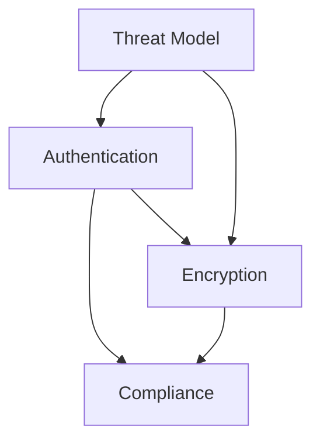

# Security

Security policies, threat models, and compliance documentation for the Celestia platform.

## Contents

| Document | Description |
| --- | --- |
| [Threat Model](threat-model.md) | The Celestia threat model identifies attack surfaces across the drone platform, ... |
| [Authentication & Authorization](authentication.md) | The Celestia platform uses OAuth 2.0 with PKCE for operator authentication and J... |
| [Encryption Standards](encryption.md) | All data in the Celestia platform is encrypted at rest and in transit. The encry... |
| [Compliance & Regulatory](compliance.md) | Celestia operates under FAA Part 107 regulations and pursues BVLOS waivers for e... |

## Section Overview

