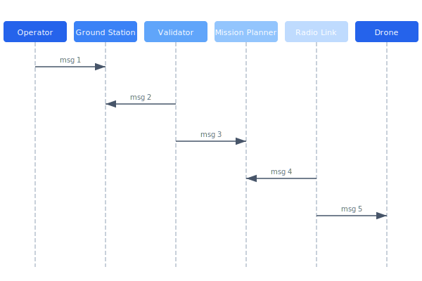

# Ground Station

The ground station software manages mission upload, real-time telemetry display, and fleet coordination. It validates all mission plans before transmission and maintains a persistent WebSocket connection to each active drone.

## Overview Diagram



---

## Implementation Reference

```rust
use std::time::{Duration, Instant};

#[derive(Debug, Clone, Copy, PartialEq)]
pub enum FlightState {
    Disarmed,
    PreflightCheck,
    Armed,
    Takeoff,
    Hovering,
    Mission,
    ReturnToHome,
    Landing,
    EmergencyLand,
}

pub struct SafetyMonitor {
    state: FlightState,
    last_heartbeat: Instant,
    battery_voltage: f32,
    altitude_m: f32,
    max_altitude_m: f32,
    geofence_radius_m: f32,
}

impl SafetyMonitor {
    pub fn new(max_alt: f32, geofence: f32) -> Self {
        Self {
            state: FlightState::Disarmed,
            last_heartbeat: Instant::now(),
            battery_voltage: 0.0,
            altitude_m: 0.0,
            max_altitude_m: max_alt,
            geofence_radius_m: geofence,
        }
    }

    pub fn check(&mut self, telemetry: &TelemetryFrame) -> Result<(), SafetyViolation> {
        self.battery_voltage = telemetry.battery_v;
        self.altitude_m = telemetry.alt_msl;

        if self.battery_voltage < 13.2 {
            return Err(SafetyViolation::LowBattery(self.battery_voltage));
        }
        if self.altitude_m > self.max_altitude_m {
            return Err(SafetyViolation::AltitudeBreach(self.altitude_m));
        }
        let distance = telemetry.position.distance_to(&telemetry.home);
        if distance > self.geofence_radius_m {
            return Err(SafetyViolation::GeofenceBreach(distance));
        }
        if self.last_heartbeat.elapsed() > Duration::from_secs(3) {
            return Err(SafetyViolation::HeartbeatLost);
        }

        self.last_heartbeat = Instant::now();
        Ok(())
    }

    pub fn trigger_emergency_land(&mut self) {
        log::warn!("safety: emergency landing triggered from state {:?}", self.state);
        self.state = FlightState::EmergencyLand;
    }
}
```

---

## Specification

| Component | Technology | Responsibility | Port |
| --- | --- | --- | --- |
| API Server | Go / Gin | REST endpoints | 8081 |
| WS Gateway | Go / Gorilla | Real-time telemetry | 8081/ws |
| Mission Validator | Go | Plan verification | Internal |
| Map Tile Server | Python / FastAPI | Offline map tiles | 8086 |
| Radio Bridge | C / libusb | USB radio interface | N/A |

### *Key Policy*

> Mission uploads must be validated against airspace restrictions and battery estimates before transmission.

## Requirements

1. Mission upload must complete within 5 seconds
2. WebSocket must reconnect automatically within 3 seconds
3. Map tiles must be available offline for the mission area
4. All mission modifications must be audit-logged

## Action Items

- [x] Implement mission plan validation
- [x] Add offline map tile caching
- [ ] Build multi-drone coordination view
- [ ] Add replay mode for post-flight analysis
- [x] Document radio bridge USB protocol

## Project Structure

ground-station/  
├── cmd/  
│   └── server/  
├── internal/  
│   ├── api/  
│   ├── ws/  
│   ├── validator/  
│   └── radio/  
└── web/  
    ├── src/  
    └── public/

---

## Related Documents

- [Communication Protocol](../architecture/communication-protocol.md)
- [WebSocket API](../api/websocket-api.md)
- [Fleet Dashboard](../engineering/fleet-dashboard.md)
