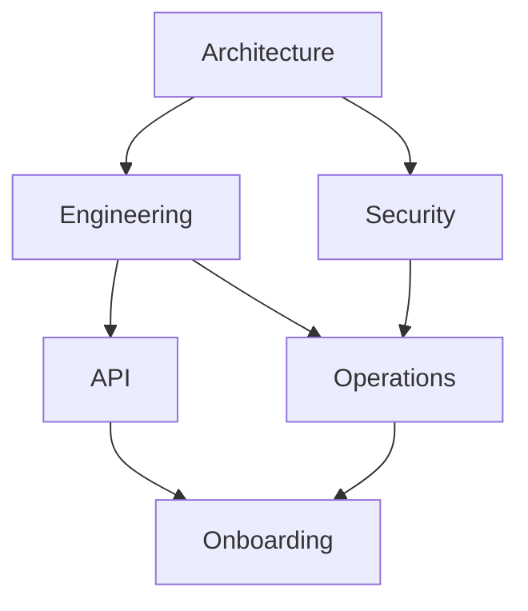

# Celestia Robotics Documentation

Celestia Robotics builds autonomous drone systems for commercial and industrial applications. This documentation hub covers every aspect of the platform — from architecture and engineering to security, operations, onboarding, and API reference.

## Documentation Sections

| Section | Description |
| --- | --- |
| [Architecture](architecture/index.md) | Core system architecture and design decisions for the Celestia drone platform. |
| [Engineering](engineering/index.md) | Engineering guides and component documentation for the Celestia drone platform. |
| [Security](security/index.md) | Security policies, threat models, and compliance documentation for the Celestia platform. |
| [Operations](operations/index.md) | Manufacturing, testing, and maintenance procedures for the Celestia drone fleet. |
| [Onboarding](onboarding/index.md) | New hire setup and team information for the Celestia engineering organization. |
| [API](api/index.md) | API reference documentation for all Celestia platform services. |

## Platform Overview

## Summary

| Section | Documents | Focus Area |
| --- | --- | --- |
| Architecture | 5 | architecture |
| Engineering | 6 | engineering |
| Security | 4 | security |
| Operations | 4 | operations |
| Onboarding | 3 | onboarding |
| API | 3 | api |

## Open Issues

Current high-impact issues tracked on the board:

- [[9XPSEI]] — ground station map tile caching serves stale imagery
- [[XVG0FN]] — representative workflow item linked by bare ID
