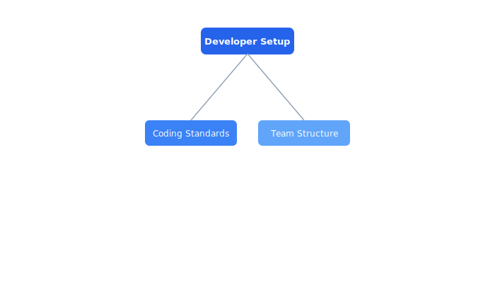

# Onboarding

New hire setup and team information for the Celestia engineering organization.

## Contents

| Document | Description |
| --- | --- |
| [Developer Setup](dev-setup.md) | This guide walks new developers through setting up their local environment for C... |
| [Coding Standards](coding-standards.md) | Celestia enforces consistent coding standards across all languages used in the p... |
| [Team Structure](team-structure.md) | The Celestia engineering organization is structured around domain teams, each ow... |

## Section Overview

