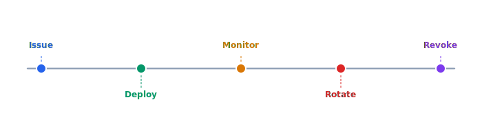

With mTLS deployed, client certificates will need automated rotation before expiry. The rotation service must handle the case where a drone is offline during the rotation window and gracefully falls back to the previous cert until reconnect.

## Diagram



## Implementation Reference

```hcl
resource "aws_ecs_service" "telemetry_ingest" {
  name            = "telemetry-ingest"
  cluster         = aws_ecs_cluster.celestia.id
  task_definition = aws_ecs_task_definition.telemetry_ingest.arn
  desired_count   = 3
  launch_type     = "FARGATE"

  network_configuration {
    subnets          = var.private_subnet_ids
    security_groups  = [aws_security_group.telemetry_ingest.id]
    assign_public_ip = false
  }

  load_balancer {
    target_group_arn = aws_lb_target_group.telemetry_ingest.arn
    container_name   = "ingest"
    container_port   = 8080
  }
}

resource "aws_security_group" "telemetry_ingest" {
  name_prefix = "telemetry-ingest-"
  vpc_id      = var.vpc_id

  ingress {
    from_port       = 8080
    to_port         = 8080
    protocol        = "tcp"
    security_groups = [aws_security_group.alb.id]
  }

  egress {
    from_port   = 0
    to_port     = 0
    protocol    = "-1"
    cidr_blocks = ["0.0.0.0/0"]
  }

  tags = {
    Service     = "telemetry-ingest"
    Environment = var.environment
    ManagedBy   = "terraform"
  }
}

resource "aws_cloudwatch_log_group" "telemetry_ingest" {
  name              = "/ecs/celestia/telemetry-ingest"
  retention_in_days = 30

  tags = {
    Service = "telemetry-ingest"
  }
}
```

## Specification

| Threat | Severity | Mitigation | Status |
| --- | --- | --- | --- |
| Command injection | Critical | mTLS + signing | In Progress |
| Telemetry spoofing | High | HMAC validation | Planned |
| Firmware tampering | Critical | Secure boot | Done |
| Replay attack | High | Nonce + timestamp | In Progress |
| Key extraction | Critical | HSM storage | Planned |

---

> All security-related changes must be reviewed by the security lead before merge. Vulnerability disclosures follow a 90-day responsible disclosure policy. Penetration test results are classified and stored in the restricted security vault.

### Requirements

1. All communications must use TLS 1.3 minimum
2. Client certificates must be rotated every 90 days
3. Failed authentication attempts must trigger alerts after 5 tries
4. Security audit logs must be immutable and retained for 2 years

### Checklist

- [x] Complete threat model for v2 flight controller
- [ ] Implement hardware security module integration
- [x] Set up automated dependency vulnerability scanning
- [ ] Create incident response playbook for drone hijack
- [ ] Audit all API endpoints for authorization gaps
