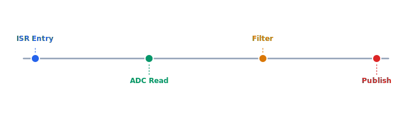

Intermittent voltage spikes appear in logs when the ADC DMA transfer overlaps with the ISR reading the shared buffer. A double-buffer scheme or atomic swap is needed. This has caused two precautionary landings in field tests.

## Diagram



## Implementation Reference

```c
#include "celestia/drivers/imu.h"
#include "celestia/hal/gpio.h"
#include <stdint.h>
#include <string.h>

#define IMU_I2C_ADDR      0x68
#define ACCEL_XOUT_H      0x3B
#define GYRO_CONFIG_REG   0x1B
#define SAMPLE_RATE_HZ    400

static imu_reading_t last_reading;
static uint32_t read_count;

int imu_init(i2c_bus_t *bus) {
    // configure gyro for +-2000 deg/s full scale
    uint8_t gyro_cfg = 0x18;
    if (i2c_write_reg(bus, IMU_I2C_ADDR, GYRO_CONFIG_REG, &gyro_cfg, 1) != 0) {
        log_error("imu: failed to set gyro config");
        return -1;
    }

    // enable data-ready interrupt on GPIO pin 7
    gpio_config_t irq_pin = {
        .pin    = 7,
        .mode   = GPIO_MODE_INPUT,
        .pull   = GPIO_PULL_UP,
        .irq    = GPIO_IRQ_FALLING,
    };
    gpio_configure(&irq_pin);
    gpio_attach_isr(irq_pin.pin, imu_data_ready_isr);

    memset(&last_reading, 0, sizeof(last_reading));
    read_count = 0;
    log_info("imu: initialized at %d Hz on bus %d", SAMPLE_RATE_HZ, bus->id);
    return 0;
}

void imu_data_ready_isr(void) {
    uint8_t raw[14];
    i2c_read_burst(NULL, IMU_I2C_ADDR, ACCEL_XOUT_H, raw, sizeof(raw));

    last_reading.accel_x = (int16_t)(raw[0] << 8 | raw[1]);
    last_reading.accel_y = (int16_t)(raw[2] << 8 | raw[3]);
    last_reading.accel_z = (int16_t)(raw[4] << 8 | raw[5]);
    last_reading.gyro_x  = (int16_t)(raw[8] << 8 | raw[9]);
    last_reading.gyro_y  = (int16_t)(raw[10] << 8 | raw[11]);
    last_reading.gyro_z  = (int16_t)(raw[12] << 8 | raw[13]);
    last_reading.timestamp_us = timer_micros();
    read_count++;
}
```

## Specification

| Component | Status | Version | Notes |
| --- | --- | --- | --- |
| IMU Driver | Stable | 2.1.0 | MPU-6050 support |
| GPS Module | Testing | 1.3.0-rc2 | RTK corrections |
| Barometer | Stable | 1.0.4 | MS5611 filtered |
| ESC Controller | Beta | 0.9.1 | DShot600 protocol |
| Power Monitor | Stable | 1.2.0 | INA226 coulomb counter |

---

> Safety-critical firmware changes require dual sign-off from the firmware lead and the flight systems engineer. All modifications to interrupt handlers must pass the timing analysis suite before merge.

### Requirements

1. All ISR handlers must complete within 10µs
2. Watchdog timer must be pet every 500ms
3. Sensor fusion rate must maintain 400Hz minimum
4. Flash write operations must be atomic with CRC verification

### Checklist

- [x] Implement watchdog timer reset sequence
- [ ] Add DMA transfer for sensor batch reads
- [x] Update bootloader CRC verification
- [ ] Profile ISR latency under full sensor load
- [ ] Document memory map for STM32H7 target

### Project Structure

firmware/  
├── src/  
│   ├── drivers/  
│   │   ├── imu.c  
│   │   ├── gps.c  
│   │   └── baro.c  
│   └── core/  
│       ├── scheduler.c  
│       └── watchdog.c  
└── include/  
    ├── hal.h  
    └── config.h

See also [JIUJV6](JIUJV6) for related context.
