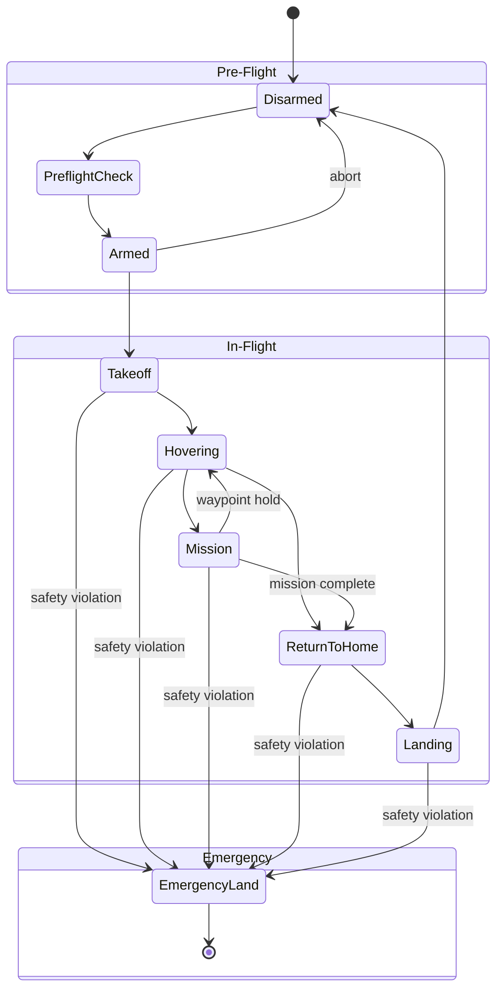

Telemetry timestamps from the CM4 co-processor drift up to 15ms relative to the CM7 main loop after 30 minutes of flight. The shared timer peripheral configuration needs review. This causes sensor fusion glitches in post-flight analysis.

## Diagram



## Implementation Reference

```rust
use std::time::{Duration, Instant};

#[derive(Debug, Clone, Copy, PartialEq)]
pub enum FlightState {
    Disarmed,
    PreflightCheck,
    Armed,
    Takeoff,
    Hovering,
    Mission,
    ReturnToHome,
    Landing,
    EmergencyLand,
}

pub struct SafetyMonitor {
    state: FlightState,
    last_heartbeat: Instant,
    battery_voltage: f32,
    altitude_m: f32,
    max_altitude_m: f32,
    geofence_radius_m: f32,
}

impl SafetyMonitor {
    pub fn new(max_alt: f32, geofence: f32) -> Self {
        Self {
            state: FlightState::Disarmed,
            last_heartbeat: Instant::now(),
            battery_voltage: 0.0,
            altitude_m: 0.0,
            max_altitude_m: max_alt,
            geofence_radius_m: geofence,
        }
    }

    pub fn check(&mut self, telemetry: &TelemetryFrame) -> Result<(), SafetyViolation> {
        self.battery_voltage = telemetry.battery_v;
        self.altitude_m = telemetry.alt_msl;

        if self.battery_voltage < 13.2 {
            return Err(SafetyViolation::LowBattery(self.battery_voltage));
        }
        if self.altitude_m > self.max_altitude_m {
            return Err(SafetyViolation::AltitudeBreach(self.altitude_m));
        }
        let distance = telemetry.position.distance_to(&telemetry.home);
        if distance > self.geofence_radius_m {
            return Err(SafetyViolation::GeofenceBreach(distance));
        }
        if self.last_heartbeat.elapsed() > Duration::from_secs(3) {
            return Err(SafetyViolation::HeartbeatLost);
        }

        self.last_heartbeat = Instant::now();
        Ok(())
    }

    pub fn trigger_emergency_land(&mut self) {
        log::warn!("safety: emergency landing triggered from state {:?}", self.state);
        self.state = FlightState::EmergencyLand;
    }
}
```

## Specification

| Component | Status | Version | Notes |
| --- | --- | --- | --- |
| IMU Driver | Stable | 2.1.0 | MPU-6050 support |
| GPS Module | Testing | 1.3.0-rc2 | RTK corrections |
| Barometer | Stable | 1.0.4 | MS5611 filtered |
| ESC Controller | Beta | 0.9.1 | DShot600 protocol |
| Power Monitor | Stable | 1.2.0 | INA226 coulomb counter |

---

> Safety-critical firmware changes require dual sign-off from the firmware lead and the flight systems engineer. All modifications to interrupt handlers must pass the timing analysis suite before merge.

### Requirements

1. All ISR handlers must complete within 10µs
2. Watchdog timer must be pet every 500ms
3. Sensor fusion rate must maintain 400Hz minimum
4. Flash write operations must be atomic with CRC verification

### Checklist

- [x] Implement watchdog timer reset sequence
- [ ] Add DMA transfer for sensor batch reads
- [x] Update bootloader CRC verification
- [ ] Profile ISR latency under full sensor load
- [ ] Document memory map for STM32H7 target

See also [9T84AZ](9T84AZ) for related context.
