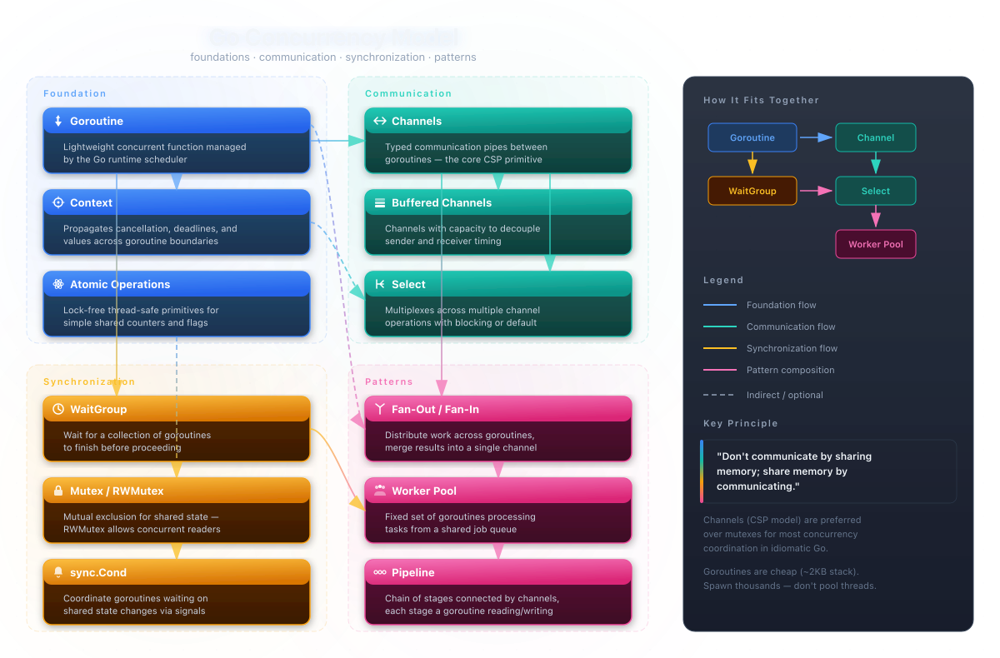
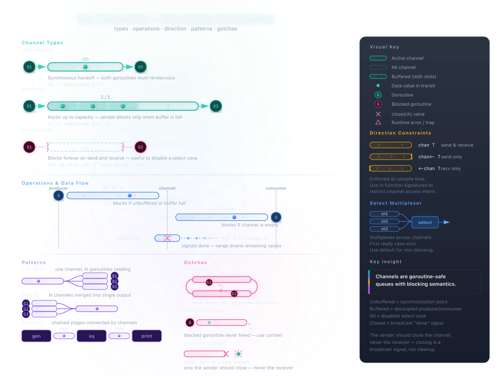
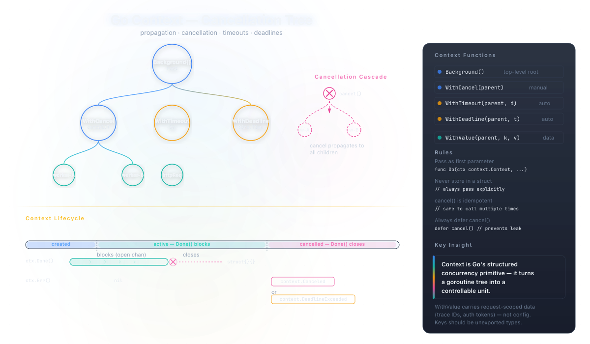
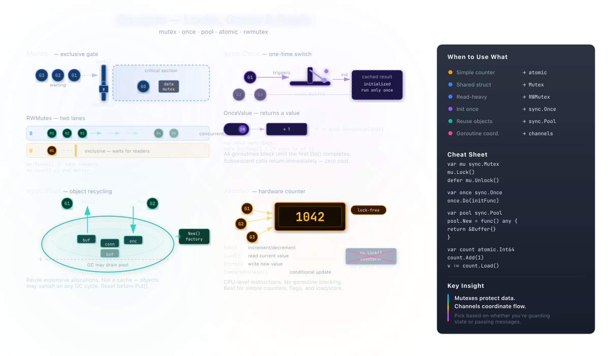
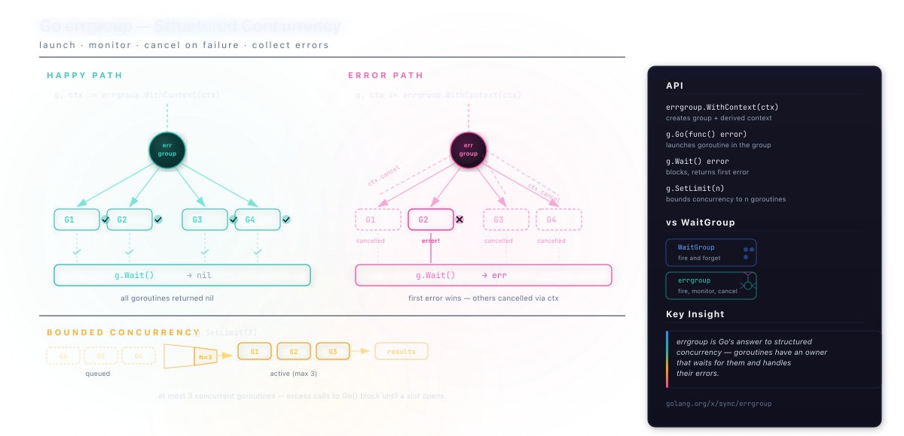
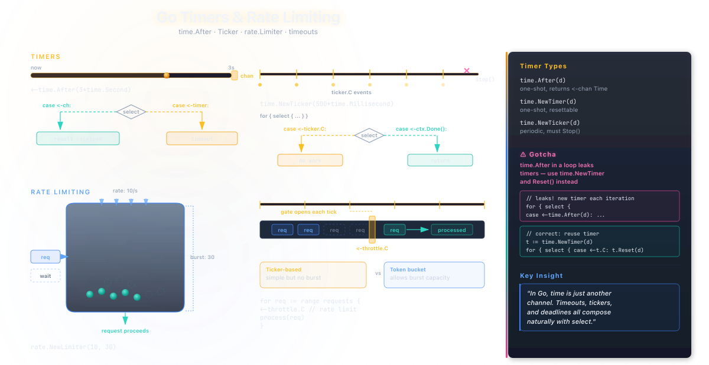
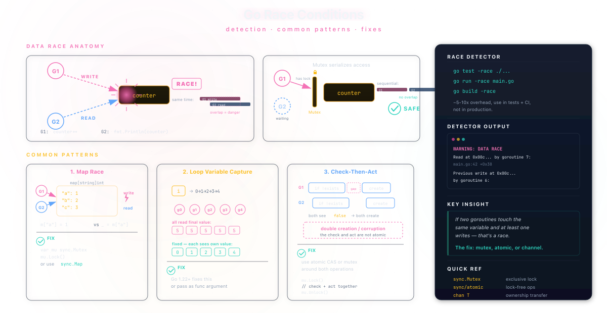
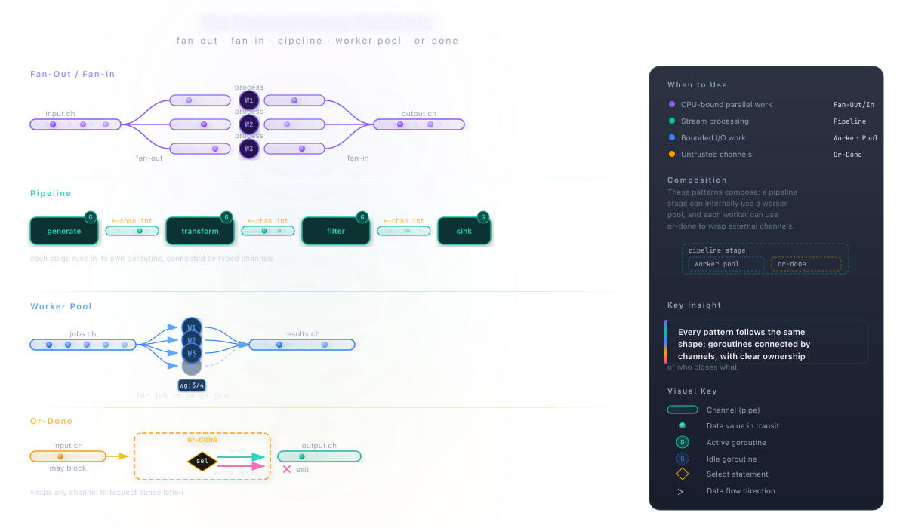

# Go Concurrency

## Table of Contents

1. [Overview](#overview)
2. [Channels](#channels)
3. [Context](#context)
4. [Synchronization Primitives](#synchronization-primitives)
5. [Error Groups](#error-groups)
6. [Timers & Rate Limiting](#timers--rate-limiting)
7. [Race Conditions](#race-conditions)
8. [Concurrency Patterns](#concurrency-patterns)

&nbsp;

---

&nbsp;

## Overview



Go's concurrency model is built on **CSP (Communicating Sequential Processes)**, a formal model where independent processes communicate through message passing rather than shared state. Instead of threads and locks, you work with goroutines and channels. The runtime multiplexes goroutines onto OS threads using the **GMP scheduler** (Goroutine, Machine, Processor), making goroutines extremely cheap — each starts with only ~2KB of stack space that grows and shrinks on demand.

> Don't communicate by sharing memory;
> share memory by communicating.
>
> — *Effective Go*

This principle inverts the traditional threading model. Rather than protecting shared data with mutexes, you pass data between goroutines through channels, ensuring only one goroutine accesses the data at a time by design.

&nbsp;

### Goroutines

A goroutine is a lightweight concurrent function managed entirely by the Go runtime, not by the operating system. The `go` keyword launches one, and execution continues immediately in the calling goroutine without waiting for it to finish. Unlike OS threads (which typically consume 1-8MB of stack), goroutines are cheap enough to create by the thousands or even millions in a single process.

```go
func main() {
    go doWork() // runs concurrently

    // main goroutine continues here
    time.Sleep(time.Second)
}

func doWork() {
    fmt.Println("working")
}
```

Goroutines are cooperatively scheduled. They yield at:

- channel send/receive operations
- system calls (file I/O, network)
- function calls (including runtime checks)
- garbage collection safe points
- `runtime.Gosched()` explicit yield

Since Go 1.14, the scheduler can also preempt long-running goroutines at async safe points, preventing a single compute-heavy goroutine from starving others.

&nbsp;

| Property | OS Thread | Goroutine |
|---|---|---|
| Initial stack | 1–8 MB | ~2 KB |
| Creation cost | ~1 ms | ~1 µs |
| Context switch | kernel-level | user-space |
| Practical limit | ~10K per process | ~1M+ per process |
| Managed by | OS scheduler | Go runtime (GMP) |

&nbsp;

### WaitGroup

`sync.WaitGroup` coordinates goroutine completion when you don't need to pass results back through channels. The pattern has three steps:

1. `wg.Add(n)` — increment the counter *before* launching goroutines
2. `defer wg.Done()` — decrement when the goroutine finishes
3. `wg.Wait()` — block until the counter reaches zero

A common mistake is calling `Add` inside the goroutine rather than before launching it, which introduces a race condition.

```go
var wg sync.WaitGroup

for i := range 5 {
    wg.Add(1)
    go func() {
        defer wg.Done()
        process(i)
    }()
}

wg.Wait() // blocks until all 5 complete
```

&nbsp;

---

&nbsp;

## Channels



Channels are typed, goroutine-safe queues with blocking semantics. They serve as the primary mechanism for goroutine communication and synchronization — a channel both transfers data and coordinates timing between producer and consumer. Understanding the distinction between buffered and unbuffered channels is essential because they have fundamentally different synchronization behavior.

> A channel is a communication mechanism that lets one
> goroutine send values to another goroutine. Each channel
> is a conduit for values of a particular type.
>
> — *The Go Programming Language*, Donovan & Kernighan

&nbsp;

### Unbuffered Channels

An unbuffered channel (`make(chan T)`) forces a synchronous handoff — the sender blocks until a receiver is ready, and vice versa. This provides a strong synchronization guarantee: at the moment a value is transferred, both goroutines are at a known point in their execution. Unbuffered channels are the default and should be your first choice unless you have a specific reason to buffer.

```go
ch := make(chan int)

go func() {
    ch <- 42 // blocks until someone receives
}()

v := <-ch // blocks until someone sends
fmt.Println(v) // 42
```

&nbsp;

### Buffered Channels

Buffered channels (`make(chan T, N)`) decouple sender and receiver by providing N slots of internal storage. The sender only blocks when the buffer is full, and the receiver only blocks when the buffer is empty. This is useful when producers and consumers operate at different speeds, or when you want to limit concurrency by using the buffer capacity as a semaphore. Be careful with sizing — an oversized buffer hides backpressure problems, while an undersized one defeats the purpose.

```go
ch := make(chan int, 3) // buffer capacity of 3

ch <- 1 // doesn't block
ch <- 2 // doesn't block
ch <- 3 // doesn't block
ch <- 4 // blocks — buffer full, waits for a receive
```

&nbsp;

| Behavior | Unbuffered (`make(chan T)`) | Buffered (`make(chan T, N)`) |
|---|---|---|
| Send blocks when | no receiver is waiting | buffer is full |
| Receive blocks when | no sender is waiting | buffer is empty |
| Synchronization | both goroutines meet | decoupled |
| Best for | signaling, handoffs | batching, rate smoothing |

&nbsp;

### Direction Constraints

Go lets you restrict channel access in function signatures to enforce intent at compile time. A `chan<-` parameter can only send; a `<-chan` parameter can only receive. This turns common mistakes — like accidentally closing a channel from the consumer side — into compile errors rather than runtime panics.

```go
func produce(out chan<- int) { ... } // send only
func consume(in <-chan int)  { ... } // receive only
```

&nbsp;

### Select

The `select` statement multiplexes across multiple channel operations, enabling a goroutine to wait on several channels simultaneously. When multiple cases are ready, Go picks one at random to prevent starvation. The `default` case makes the select non-blocking — useful for polling or trylock patterns. A `select` with no cases (`select{}`) blocks forever, which is occasionally useful for keeping a main goroutine alive.

```go
select {
case v := <-ch1:
    fmt.Println("from ch1:", v)
case v := <-ch2:
    fmt.Println("from ch2:", v)
case ch3 <- value:
    fmt.Println("sent to ch3")
default:
    fmt.Println("no channel ready")
}
```

&nbsp;

### Close and Range

Closing a channel is a broadcast signal — all goroutines blocked on receive will unblock and get the zero value. The `range` keyword drains remaining buffered values and then exits when the channel closes.

Channel close rules:

- [x] only the sender should close
- [x] close after all values have been sent
- [ ] never close from the receiver side
- [ ] never send on a closed channel (panics)
- [ ] never close an already-closed channel (panics)

&nbsp;

```go
go func() {
    for i := range 5 { ch <- i }
    close(ch)
}()
for v := range ch { fmt.Println(v) } // 0, 1, 2, 3, 4
```

> You don't need to close a channel to release resources.
> Channels are garbage collected like any other value.
> Close a channel only when the receiver needs to know
> that no more values are coming.

&nbsp;

---

&nbsp;

## Context



`context.Context` is Go's mechanism for propagating cancellation signals, deadlines, and request-scoped values across API boundaries and goroutine trees. Every production Go service relies on it — HTTP servers create a context per request, database drivers respect context cancellation, and gRPC threads it through the entire call chain. Without context, you end up with goroutine leaks: workers that keep running long after the result is no longer needed.

> Context carries deadlines, cancellation signals,
> and request-scoped values across API boundaries.
> It is the standard way to control goroutine lifecycles
> in production Go code.

&nbsp;

### Cancellation

`context.WithCancel` returns a derived context and a cancel function. When cancel is called, the context's `Done()` channel closes, which unblocks any goroutine listening on it. The cancellation propagates downward through the context tree — cancelling a parent automatically cancels all derived child contexts. Always `defer cancel()` immediately after creation to prevent resource leaks, even if you plan to cancel explicitly later.

```go
ctx, cancel := context.WithCancel(context.Background())
defer cancel()

go func() {
    select {
    case <-ctx.Done(): return // cancelled
    case result := <-doWork():
        // use result
    }
}()
```

&nbsp;

### Timeouts and Deadlines

`context.WithTimeout` cancels automatically after a duration, while `context.WithDeadline` cancels at a specific wall-clock time. Under the hood, `WithTimeout` is just `WithDeadline(parent, time.Now().Add(d))`. These are critical for networked services — without timeouts, a slow downstream dependency can cause cascading failures as goroutines pile up waiting indefinitely.

```go
// cancel after 3 seconds
ctx, cancel := context.WithTimeout(context.Background(), 3*time.Second)
defer cancel()

result, err := fetchWithContext(ctx)
if errors.Is(err, context.DeadlineExceeded) {
    log.Println("request timed out")
}
```

&nbsp;

| Function | Cancellation | Use case |
|---|---|---|
| `WithCancel(parent)` | manual `cancel()` call | user-initiated abort, shutdown |
| `WithTimeout(parent, d)` | after duration `d` | HTTP requests, RPC calls |
| `WithDeadline(parent, t)` | at time `t` | batch jobs with hard cutoff |
| `WithValue(parent, k, v)` | inherits parent's | trace IDs, auth tokens |

&nbsp;

### Context Tree

Contexts form a tree — cancelling a parent cancels all its children, but cancelling a child does not affect the parent or siblings. This mirrors the natural structure of request handling: a top-level HTTP handler creates a context, passes it to middleware, which passes it to service calls, which pass it to database queries. If the client disconnects, everything downstream gets cancelled automatically.

Context rules to live by:

- [x] pass as the **first parameter** of functions doing I/O or long-running work
- [x] always `defer cancel()` immediately after creation
- [x] use `context.TODO()` as a placeholder when unsure which context to use
- [ ] never store context in a struct field
- [ ] never pass `nil` — use `context.TODO()` instead
- [ ] never use `WithValue` for data that should be function parameters

&nbsp;

---

&nbsp;

## Synchronization Primitives



When channels aren't the right fit, the `sync` package provides low-level primitives. Reach for them when you need to:

- protect shared data structures from concurrent access
- run initialization code exactly once
- reuse expensive temporary objects across goroutines
- perform lock-free atomic updates on simple values

The general rule: prefer channels for coordination between goroutines, and use sync primitives for protecting shared data structures. In practice, most Go programs use both.

> Channels orchestrate; mutexes serialize.
> Use channels when ownership of data transfers
> between goroutines. Use mutexes when multiple
> goroutines access shared state in place.

&nbsp;

### Mutex and RWMutex

`sync.Mutex` provides mutual exclusion — only one goroutine can hold the lock at a time. `sync.RWMutex` is the read-write variant: it allows any number of concurrent readers, but writers get exclusive access. Use `RWMutex` when reads vastly outnumber writes (e.g., a configuration cache); use plain `Mutex` otherwise, since `RWMutex` has slightly higher overhead. Always use `defer mu.Unlock()` to guarantee release, even if a panic occurs.

```go
type SafeCounter struct {
    mu sync.RWMutex
    v  map[string]int
}

func (c *SafeCounter) Inc(key string) {
    c.mu.Lock()
    defer c.mu.Unlock()
    c.v[key]++
}

func (c *SafeCounter) Get(key string) int {
    c.mu.RLock()
    defer c.mu.RUnlock()
    return c.v[key]
}
```

&nbsp;

| Primitive | Concurrent reads | Concurrent writes | Use case |
|---|---|---|---|
| `sync.Mutex` | no | no | general shared state |
| `sync.RWMutex` | yes | no (exclusive) | read-heavy workloads |
| `sync.Map` | yes | yes (sharded) | dynamic key sets, few writes |

&nbsp;

### sync.Once

`sync.Once` guarantees that a function runs exactly once, no matter how many goroutines call it concurrently. This is the standard pattern for lazy initialization of singletons — database connections, configuration loading, expensive computations. All callers block until the first execution completes, so the initialized value is guaranteed visible. Go 1.21 added `sync.OnceValue` and `sync.OnceValues` for the common case where you need the return value.

```go
var (
    instance *Database
    once     sync.Once
)

func GetDB() *Database {
    once.Do(func() {
        instance = connectToDatabase()
    })
    return instance
}
```

&nbsp;

### sync.Pool

`sync.Pool` provides a cache of temporary objects that can be reused across goroutines to reduce garbage collection pressure. Objects in the pool may be evicted at any GC cycle, so pools are only appropriate for short-lived, resettable objects. Good candidates:

- `bytes.Buffer` for serialization/encoding
- `json.Encoder` / `json.Decoder` instances
- scratch slices or structs in hot paths
- gzip/zlib writers for HTTP compression

In high-throughput servers, pools can dramatically reduce allocation rates and GC pause times.

```go
var bufPool = sync.Pool{
    New: func() any { return new(bytes.Buffer) },
}

buf := bufPool.Get().(*bytes.Buffer)
defer func() { buf.Reset(); bufPool.Put(buf) }()
```

&nbsp;

### Atomic Operations

For simple counters, flags, and pointer swaps, `sync/atomic` provides lock-free operations that are faster than mutexes for single-value access. Go 1.19 introduced typed wrappers (`atomic.Int64`, `atomic.Bool`, `atomic.Pointer[T]`) that are safer and more readable than the older function-based API. Atomics are appropriate for metrics, counters, and feature flags — but if you need to update multiple related fields together, use a mutex instead.

```go
var ops atomic.Int64

for range 1000 {
    go func() {
        ops.Add(1)
    }()
}

time.Sleep(time.Second)
fmt.Println("ops:", ops.Load()) // 1000
```

&nbsp;

---

&nbsp;

## Error Groups



`golang.org/x/sync/errgroup` provides structured concurrency — a model where goroutines have a clear owner that launches them, waits for them, and handles their errors. What errgroup gives you over bare `go` + `sync.WaitGroup`:

- automatic error collection — `Wait()` returns the first non-nil error
- automatic cancellation — one failure cancels all siblings via derived context
- bounded concurrency — `SetLimit(n)` without manual semaphore channels
- guaranteed cleanup — no goroutine outlives the group

With errgroup, the first error cancels all sibling goroutines via the derived context, and `Wait()` returns that error to the caller.

> errgroup is Go's answer to structured concurrency.
> Every goroutine has an owner that waits for it
> and handles its errors — no fire-and-forget,
> no silent failures.

&nbsp;

### Basic Usage

The typical pattern is: create a group with `WithContext`, launch work with `g.Go`, and collect the result with `g.Wait`. The derived context is cancelled on the first error, so other goroutines can check `ctx.Done()` to bail out early. This naturally prevents goroutine leaks — you always know when all your goroutines have finished.

```go
import "golang.org/x/sync/errgroup"

func fetchAll(ctx context.Context, urls []string) error {
    g, ctx := errgroup.WithContext(ctx)

    for _, url := range urls {
        g.Go(func() error {
            return fetch(ctx, url)
        })
    }

    return g.Wait() // returns first non-nil error
}
```

&nbsp;

### Bounded Concurrency

`SetLimit` caps the number of goroutines running concurrently. When the limit is reached, further calls to `g.Go` block until a running goroutine completes. This replaces the common manual semaphore-with-buffered-channel pattern, which is error-prone and verbose by comparison. Bounded concurrency is essential when you're making external calls (API requests, database queries) and need to avoid overwhelming downstream services.

```go
func processFiles(files []string) error {
    g := new(errgroup.Group)
    g.SetLimit(10) // at most 10 concurrent goroutines

    for _, f := range files {
        g.Go(func() error {
            return processFile(f)
        })
    }

    return g.Wait()
}
```

&nbsp;

| Feature | `sync.WaitGroup` | `errgroup.Group` |
|---|---|---|
| Error collection | manual | first error returned by `Wait()` |
| Context cancellation | manual | automatic on first error |
| Concurrency limiting | manual (buffered chan) | `SetLimit(n)` |
| Goroutine leak risk | higher | lower (structured ownership) |

&nbsp;

---

&nbsp;

## Timers & Rate Limiting



Go's timer and ticker types integrate naturally with channels and `select`, making time-based operations composable with other concurrent primitives. Rate limiting is critical for production services — without it, a spike in traffic can overwhelm databases, exhaust file descriptors, or trigger cascading failures across microservices.

&nbsp;

### time.After and Timeouts

`time.After(d)` returns a `<-chan time.Time` that fires once after duration `d`. Combined with `select`, this creates a clean timeout pattern. Note that `time.After` allocates a timer that isn't garbage collected until it fires, so avoid it in tight loops — use `time.NewTimer` with explicit `Stop()` instead.

```go
select {
case result := <-ch:
    fmt.Println("got:", result)
case <-time.After(3 * time.Second):
    fmt.Println("timed out")
}
```

&nbsp;

### Ticker for Periodic Work

`time.NewTicker` fires at regular intervals and delivers ticks on its channel `C`. Unlike `time.After`, a ticker keeps firing until stopped — always `defer ticker.Stop()` to release resources. Tickers are the building block for polling loops, heartbeat checks, and periodic cleanup tasks. Pair them with `select` and `ctx.Done()` for clean shutdown.

```go
ticker := time.NewTicker(500 * time.Millisecond)
defer ticker.Stop()

for {
    select {
    case <-ticker.C:
        poll()
    case <-ctx.Done():
        return
    }
}
```

&nbsp;

### Rate Limiting

The `golang.org/x/time/rate` package implements a token-bucket rate limiter. Tokens accumulate at a steady rate up to a burst capacity. `Wait(ctx)` blocks until a token is available or the context expires. This is the standard approach for rate-limiting outbound API calls, database queries, or any resource that can be overwhelmed. For simple cases, a `time.Ticker` can serve as a basic throttle — one request per tick.

```go
import "golang.org/x/time/rate"

// 10 events per second, burst of 30
limiter := rate.NewLimiter(10, 30)

func handleRequest(ctx context.Context) error {
    if err := limiter.Wait(ctx); err != nil {
        return err // context cancelled while waiting
    }
    return processRequest()
}
```

&nbsp;

| Method | Behavior | Use case |
|---|---|---|
| `limiter.Wait(ctx)` | blocks until allowed | background jobs, pipelines |
| `limiter.Allow()` | returns true/false immediately | request admission control |
| `limiter.Reserve()` | returns reservation with delay | scheduled future work |

&nbsp;

---

&nbsp;

## Race Conditions



A data race occurs when two goroutines access the same variable concurrently and at least one access is a write. Data races are among the most insidious bugs in concurrent programs — they can produce corrupted data, crashes, or security vulnerabilities, and they often manifest only under specific timing conditions that are difficult to reproduce. Go takes data races seriously: the language specification states that a program with a data race has undefined behavior.

> A data race is not just a bug — it's undefined behavior.
> The compiler and runtime are allowed to assume your
> program is race-free. If it isn't, anything can happen:
> torn reads, stale caches, reordered writes.

&nbsp;

### The Race Detector

Go's built-in race detector is one of the language's most valuable tools. It instruments memory accesses at compile time and detects races at runtime, reporting the exact goroutines and stack traces involved. It catches races that would otherwise take weeks to reproduce in production.

Race detector checklist:

- [x] enable in CI with `go test -race ./...`
- [x] use during local development with `go run -race`
- [x] test concurrent code paths specifically (parallel subtests)
- [ ] don't run in production (~5-10x CPU and memory overhead)
- [ ] don't ignore race reports — they indicate undefined behavior

&nbsp;

```bash
go test -race ./...
go run -race main.go
go build -race -o myapp
```

&nbsp;

### Common Race Patterns

The most common race patterns in Go codebases:

1. **Unsynchronized map access** — maps are not goroutine-safe; concurrent read/write causes a runtime panic
2. **Loop variable capture** — pre-Go 1.22, goroutines in a loop all captured the same variable
3. **Slice append from multiple goroutines** — append is not atomic; the backing array can be corrupted
4. **Read-modify-write on shared variables** — `counter++` is not atomic; use `sync/atomic` or a mutex
5. **Publishing partially initialized structs** — another goroutine may see incomplete fields

&nbsp;

**Unsynchronized map access** deserves special attention. The fix is either a `sync.Mutex` wrapping the map, or `sync.Map` for cases with many goroutines and infrequent writes.

```go
// BUG: concurrent map read/write
m := make(map[string]int)
go func() { m["a"] = 1 }()
go func() { _ = m["a"] }()

// FIX: use sync.Mutex or sync.Map
var mu sync.Mutex
go func() { mu.Lock(); m["a"] = 1; mu.Unlock() }()
go func() { mu.Lock(); _ = m["a"]; mu.Unlock() }()
```

&nbsp;

**Loop variable capture** was a persistent source of bugs before Go 1.22. Goroutines launched in a loop captured the loop variable by reference, meaning all of them would see the final value by the time they executed. Go 1.22 changed the semantics so each iteration gets its own copy. For pre-1.22 code, the fix is to pass the variable as a function argument.

&nbsp;

Concurrency code review checklist:

- [ ] every goroutine has a clear shutdown path (context, channel close, or WaitGroup)
- [ ] shared state is protected by a mutex or accessed through channels
- [ ] maps accessed from multiple goroutines use `sync.Mutex` or `sync.Map`
- [ ] `defer cancel()` follows every `WithCancel`/`WithTimeout`/`WithDeadline`
- [ ] `go test -race` passes in CI
- [ ] no goroutine leak — every `go func()` has an owner that waits for it

&nbsp;

---

&nbsp;

## Concurrency Patterns



These patterns are composable building blocks for concurrent Go programs. They compose naturally — a pipeline stage can internally use a worker pool, each worker can use an or-done wrapper, and the whole thing can be bounded with errgroup. Choosing the right pattern:

- **Fan-Out/Fan-In** — when you have N independent items to process in parallel
- **Pipeline** — when data flows through sequential transformation stages
- **Worker Pool** — when you need a fixed number of long-lived goroutines consuming from a queue
- **Or-Done** — when reading from a channel that may never close or may outlive your goroutine

> The strength of Go's concurrency model is composition.
> Goroutines and channels are cheap enough that you can
> use patterns as building blocks rather than designing
> monolithic concurrent architectures.

&nbsp;

### Fan-Out / Fan-In

Fan-out distributes work from a single source across multiple goroutines for parallel processing. Fan-in merges results from multiple goroutines back into a single channel. Together they form the most common parallelism pattern in Go — use fan-out when individual items are independent and CPU- or IO-bound, and fan-in when you need to collect results in one place. The number of fan-out workers should match the bottleneck: CPU count for compute work, or a reasonable concurrency limit for IO work.

```go
// fan-out: spawn N workers reading from the same input channel
for range workers {
    go func() {
        for job := range in { out <- process(job) }
    }()
}

// fan-in: merge multiple channels into one
for _, ch := range channels {
    go func() {
        for v := range ch { merged <- v }
    }()
}
```

&nbsp;

### Pipeline

A pipeline chains processing stages, each connected by channels. Each stage is a goroutine (or group of goroutines) that reads from an input channel, transforms the data, and writes to an output channel. Pipelines naturally handle backpressure — if a slow stage can't keep up, its input channel fills and the upstream stage blocks. This self-regulating behavior is one of the key advantages over thread-pool-based architectures.

```go
func stage(in <-chan int) <-chan int {
    out := make(chan int)
    go func() {
        defer close(out)
        for v := range in { out <- transform(v) }
    }()
    return out
}

// compose: generate → square → print
out := square(generate(2, 3, 4))
for v := range out { fmt.Println(v) }
```

&nbsp;

### Worker Pool

A worker pool is a fixed set of goroutines consuming tasks from a shared job channel. It bounds concurrency naturally — the number of workers is the concurrency limit. This is simpler than errgroup's `SetLimit` when you don't need error collection, and it integrates well with context cancellation via `select`. Worker pools are the standard pattern for processing queues, handling connections, and parallelizing IO-bound work.

```go
for range numWorkers {
    go func() {
        for job := range jobs {
            select {
            case <-ctx.Done(): return
            case results <- process(job):
            }
        }
    }()
}
```

&nbsp;

### Or-Done Channel

The or-done pattern wraps a channel read so it respects context cancellation. Without it, a goroutine reading from a slow or abandoned channel will block indefinitely — a classic goroutine leak. The wrapper uses a nested `select` to check both the channel and the context's `Done()` channel on every iteration, ensuring the goroutine can always be shut down cleanly.

```go
func orDone(ctx context.Context, ch <-chan int) <-chan int {
    out := make(chan int)
    go func() {
        defer close(out)
        for {
            select {
            case <-ctx.Done():
                return
            case v, ok := <-ch:
                if !ok { return }
                select {
                case out <- v:
                case <-ctx.Done(): return
                }
            }
        }
    }()
    return out
}
```

&nbsp;

| Pattern | Purpose | When to use |
|---|---|---|
| Fan-Out / Fan-In | parallelize independent work | CPU or IO bound items |
| Pipeline | chain sequential transformations | multi-stage data processing |
| Worker Pool | fixed concurrency with task queue | connection handling, job queues |
| Or-Done | cancellation-safe channel reads | wrapping external/untrusted channels |
